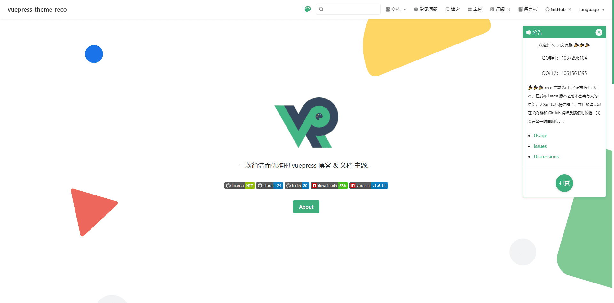

--- 
title: vuepres-reco主题
date: 2021-05-22 08:45:02
author: 'Mr.Lan'
sidebar: 'auto'
categories: 
 - 前端
tags: 
 - vue
 - vuepress
 - reco主题
publish: true
autoGroup-2: 主题应用
---


## **1. 主题介绍**
简洁的博客主题 [官网](http://vuepress-theme-reco.recoluan.com)
::: danger
自己在网上找到一个由作者组成团队的文档地址[网传官网](http://www.likemashang.com/)

如果现在时间能够访问建议查看官网使用描述

date：2021-06-02 两个官网因为未知原因无法访问
:::
### **1.1主题安装**
这里采用npm的安装方式
+ 在已有的博客上安装（前的方法）
    ``` sh
    cnpm i vuepress-theme-reco
    ```
+ 直接使用主题初始化项目
    ``` sh
    npm install @vuepress-reco/theme-cli -g
    theme-cli init
    ```

## **2. 主题配置**
先贴出本篇博客的配置文件
``` js
theme: 'reco',
themeConfig: {
    type: 'blog', // 主题类型
    nav: nav, // 自定义顶部导航栏，外部引入的nav.js文件
    authorAvatar: 'img/head.png', // 首页头像文件
    blogConfig: { // 插入的顶部导航栏
        category: {
            location: 2, // 在导航栏菜单中所占的位置，默认2
            text: '分类' // 默认文案 “分类”
        },
        tag: {
            location: 3, // 在导航栏菜单中所占的位置，默认3
            text: '标签' // 默认文案 “标签”
        }
    },
    // valineConfig: {
    //     appId: '...', // your appId
    //     appKey: '...', // your appKey
    // },
    // vssueConfig: {
    //     platform: 'github',
    //     owner: 'OWNER_OF_REPO',
    //     repo: 'NAME_OF_REPO',
    //     clientId: 'YOUR_CLIENT_ID',
    //     clientSecret: 'YOUR_CLIENT_SECRET',
    // },
    friendLink: friendLink,// 友链外部引入的friendLink.js文件
    lastUpdated: 'Last Updated',
    searchMaxSuggestoins: 10,
    serviceWorker: {
        updatePopup: {
            message: "有新的内容.",
            buttonText: '更新'
        }
    },
    editLinks: true,
    editLinkText: '在 GitHub 上编辑此页 ！',
},
```
`valineConfig`和`vssueConfig`是配置评论的两种方式，有需要可以参考官网使用

可以看出主题没有过于繁琐的配置文件
## **3. 文件内配置及**
文件内配置可以参考[vuepress的README.md篇](./vuepress_readme.md)中的普通文件夹README.md

这里相比之前的配置多说一个可用配置选项

**文章加密**

在头文件中添加
```
---
keys:
  - '123456'
  - 'abc'
---
```
可以设置多个密码

但是本人的博客测试了很多次都显示密码错误，不知是否是版本冲突