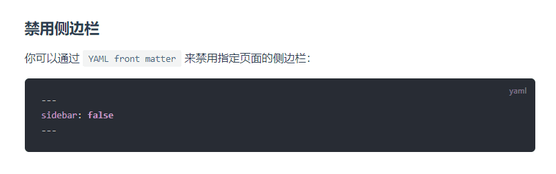
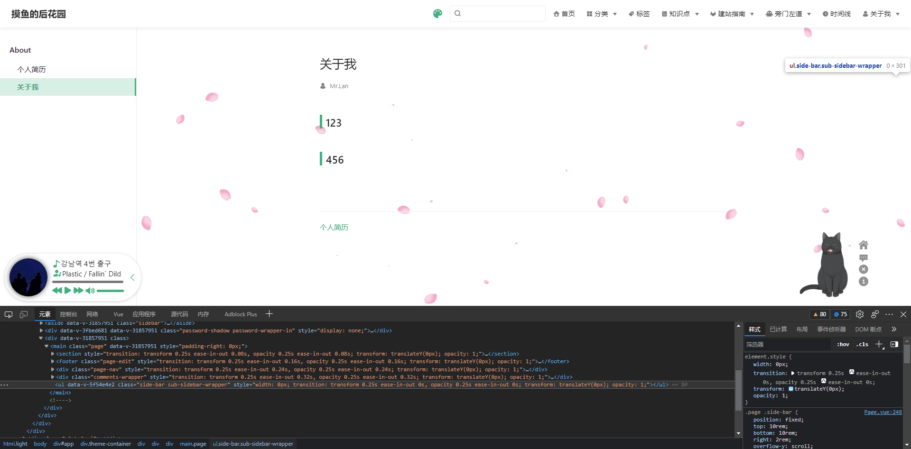
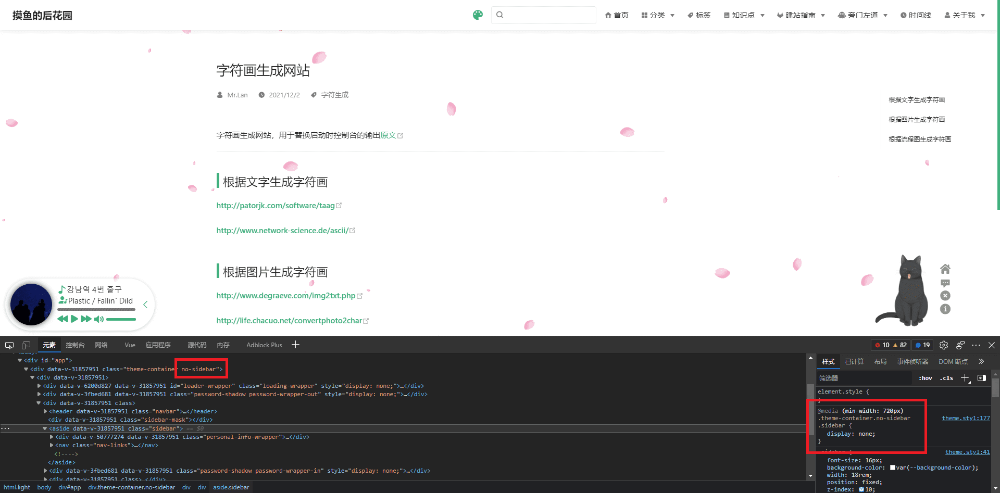
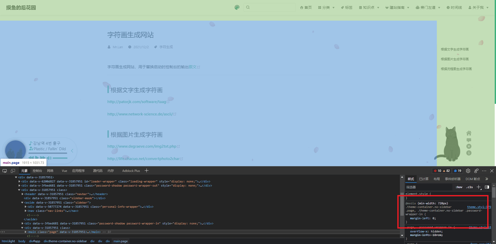
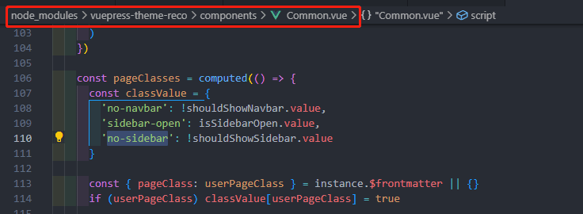
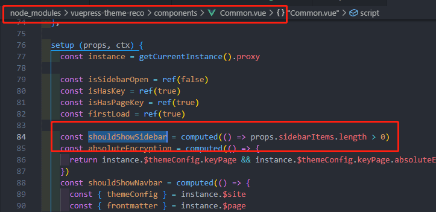

--- 
title: vuepres-reco主题@1.6.6版本中不能配置左侧文章导航显隐，修改依赖增加此功能
date: 2022-04-19 11:00:47
author: 'Mr.Lan'
sidebar: 'auto'
categories: 
 - 前端
tags: 
 - vue
 - vuepress
 - reco主题
publish: true
---

官方文档中说明了能通过在 `.md` 单篇博客文件中配置 `sidebar: false` 来去除导航栏，实则@1.6.6版本（其他没试）去除的是右侧文章内**标题导航**，**非左侧文章导航**

现通过**直接修改依赖包**内文件使得配置生效（缺点更新依赖会失效）
<!-- more -->


## 官方配置sidebar: false效果



``` md
---
title: 关于我
date: 
author: 'Mr.Lan'
sidebar: false
---
## 123
## 456
```

右侧本应该带有两个标题导航，但ul列表为空 `sidebar: false` 配置生效去除右侧导航



但是对于特定要求（例如左侧只有单篇文章或需要全幅显示文章）下要去除左侧文章导航

## 不动依赖去除vuepres-reco主题左侧导航的方法

官方文档中可以将 `markdown` 文档替换自定义 `vue` 组件，在组件中通过样式去除**文章导航栏**

经过观察去除两个样式可以完全隐藏导航：


1. 将 `.sidebar` 进行 `display: none` 隐藏
2. 去除 `.page` 的左侧间距 `margin-left: 0`

`markdown` 文章配置：
``` markdown
---
title: 关于我
date: 
author: 'Mr.Lan'
layout: aboutMe
---

## 自带标题
```

`/doce/.vuepres/components/aboutMe` vue组件代码：
``` vue
<template>
    <div id="aboutMe">
        <layout></layout>
    </div>
</template>

<script>
    export default {}
</script>

<style>
    #aboutMe .sidebar {
        display: none;
    }
    #aboutMe .page {
        margin-left: 0;
    }
</style>
```
页面依然正常显示markdown内容


::: warning
一定要放入 `layout` 组件，它作为主题全局组件负责整个页面显示内容
:::

但是这种方式是将整个页面替换成自己的组件，弊端是原本的页面跳转运用了 `vue路由` 进行**局部刷新**，但现在替换页面**顶部导航也会跟着刷新**，不仅跳转效果不好，还浪费了资源。

所以还是利用主题配置进行局部去除左侧导航栏作为稳妥

## 修改vuepres-reco主题依赖新增配置去除左侧文章导航

1. 观察依赖文件发现有两个地方传入了**导航栏数据**（文章导航和标题导航结合）


2. 尝试单独将 `Common` 的 `sidebarItems` 传入空数组，保存重启项目

``` vue
<Common :sidebarItems="[]" :showModule="recoShowModule">
```

左侧文章导航的确消失，并且 `.page` 的左侧间距也没有了

3. 打开控制台查看发现多了一个类名将之前判断的两个关键点影响了




4. 继续搜索 `no-sidebar` 样式



`shouldShowSidebar.value` 的值控制了样式的显隐，并且是通过 `props` 传入的 `sidebarItems` 数组长度判断真假，由此更证实了之前传入空数组的操作的确会影响左侧文章导航栏的显示



5. 解决方案

在计算 `shouldShowSidebar` 真假的时候引入配置判断就能够通过配置影响显隐，而非完全靠导航对象长度判断

``` js
// 原代码
const shouldShowSidebar = computed(() => props.sidebarItems.length > 0)

// 替换
const shouldShowSidebar = computed(() => {
    return instance.$frontmatter.leftSidebar !== false && props.sidebarItems.length > 0
})
```

markdown 文件配置增加新属性：

``` markdown
---
title: 关于我
date: 
author: 'Mr.Lan'
leftSidebar: false
---
```

重启项目测试发现样式的确增加上去，并且生效。在插件中也能够看到属性，没有属性的页面也正常显示


***

至此就解决了利用配置隐藏左侧文章导航栏的功能。