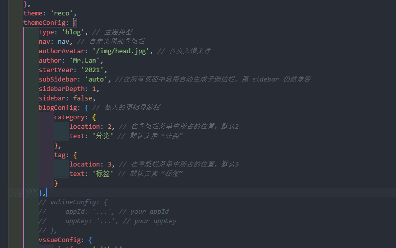

--- 
title: vuepres中config.js的配置
date: 2021-05-22 08:45:02
author: 'Mr.Lan'
sidebar: 'auto'
categories: 
 - 前端
tags: 
 - vue
 - vuepress
publish: true
autoGroup-1: vuepress
autoPrev: vuepress_install
---

博客创建指南第二章
<!-- more -->

***
`./docs/.vuepress/config.js`该文件为默认端项目配置文件

具体的配置信息过多，并且[官方](https://vuepress.vuejs.org/zh/config/)有着详细介绍和使用

## **1. config.js基础配置**
在此只介绍必要的配置属性（高亮为目前必要，剩余后期需要）
``` js{2-11,13}
module.exports = {
    title: '',// 网站标题 兼首页大标题
    description: '',// 首页标题的说明
    dest: './dist',// build打包后的位置
    port: '80',// dev启动端口号
    head: [// 项目头部的引入元素（JavaScript，icon...）
        ['link', { rel: 'icon', href: '/img/logo.ico' }],
    ],
    markdown: {
        lineNumbers: true// markdown代码块显示行数
    },
    theme: '',// 主题引入
    themeConfig: {},// 主题配置
    plugins: [],// 插件引入和配置
}
```
`theme`和`themeConfig`在主题中会有详细介绍

`plugins`安装部分插件美化博客界面

### **1.1 head配置**
在head中我们能够引入网页头部需要的其他资源

::: danger 注意
这里对应的根目录为`./docs/.vuepress/public`
:::

+ 网页的icon图标引入
``` js
['link', { rel: 'icon', href: '/img/logo.ico' }]
```
+ 引入JavaScript（例如jquery）
``` js
["script", {
    "language": "javascript",
    "type": "text/javascript",
    "src": "https://cdn.bootcdn.net/ajax/libs/jquery/3.5.1/jquery.min.js"
}]
```
+ 如需要修改样式
创建`.vuepress/styles/palette.styl`文件
``` stylus
// 颜色
$accentColor = #3eaf7c
$textColor = #2c3e50
$borderColor = #eaecef
$codeBgColor = #282c34
$arrowBgColor = #ccc
$badgeTipColor = #42b983
$badgeWarningColor = darken(#ffe564, 35%)
$badgeErrorColor = #DA5961

// 布局
$navbarHeight = 3.6rem
$sidebarWidth = 20rem
$contentWidth = 740px
$homePageWidth = 960px

// 响应式变化点
$MQNarrow = 959px
$MQMobile = 719px
$MQMobileNarrow = 419px
```
+ 引入css（方式二）
``` js
['link', { rel: 'stylesheet', href: '/css/style.css' }]
```

### **1.2 themeConfig配置**
::: danger 建议
这一段的配置在使用主题后会有轻微的改变

建议只是看些相关参数的意义

如果想直接配置美观的主题，建议参考[reco主题篇](./reco_theme.md)中themeConfig的配置
:::
``` js{2-20}
themeConfig: {
    nav: [{
        text: '指南', link: '/guide/'
    }],
    sidebar: {'/guide/':[
        {
            title:'指南1',
            collapsable: true,
            children:[
            '/guide/one',
            ]
        },
        {
            title:'指南2',
            collapsable: true,
            children:[
            '/guide/two1',
            '/guide/two2',
            ]
        }
    ]},
    sidebarDepth: 2,// 侧导航栏深度
    lastUpdated: 'Last Updated',// 更新时间前缀名
    searchMaxSuggestoins: 10,// 设置搜索的最大结果数
    serviceWorker: {
        updatePopup: {
            message: "有新的内容.",
            buttonText: '更新'
        }
    },
    editLinks: true,
    editLinkText: '在 GitHub 上编辑此页 ！'
}
```
#### **nav配置了顶部导航栏**
+ `{text: '指南', link: '/guide/'}`是最简洁的配置方式
+ 这样的配置的结果，会在导航栏生成一个没有子菜单的跳转链接

#### **sidebar配置侧边导航**
+ 在配置了顶部导航之后，为了方便管理该文件夹下的全部文件
+ 可以在sidebar中按照代码进行侧栏分组
+ children中对应着归纳为一组的文件
``` js
{
    title:'指南2',
    collapsable: true,
    children:[
    '/guide/two1',
    '/guide/two2',
    ]
}
```

#### **nav下拉分组**
+ 顶部导航也能够像侧栏一样进行分组增加子条目
+ 只需增加items配置
``` js
{
    text: '知识分类',
    link: '/know/',
    items: [
        { text: 'Vue', link: '/know/vue/' },
        { text: 'React', link: '/know/react/' },
    ]
}
```
+ 在这样的配置之后，还要为`/know/vue/`和`/know/react/`依次配置左侧菜单

### **1.3 优化配置**
+ 分开文件配置
    - 过于冗杂的配置会导致`config.js`文件越来大难以维护
    - 因此可以将部分配置分离出js文件引入配置
    - 在配置中引入```const nav = require('./nav.js')```进行配置
    ``` js
    // nav.js
    module.exports = [
        {
            text: '知识分类',
            link: '/know/',
            items: [
                { text: 'Vue', link: '/know/vue/' },
                { text: 'React', link: '/know/react/' },
            ]
        },
        ...
    ]
    ```
***
themeConfig基础配置就此结束
::: tip 扩展
在后期过多的文件夹和文件并不利于文件的配置

每次新增文件就需增加配置，这样的维护我们并不想看见

因此在主题篇中会介绍插件[Vuepress Plugin Auto Sidebar](https://shanyuhai123.github.io/vuepress-plugin-auto-sidebar/zh/)有兴趣可以提前了解下
:::