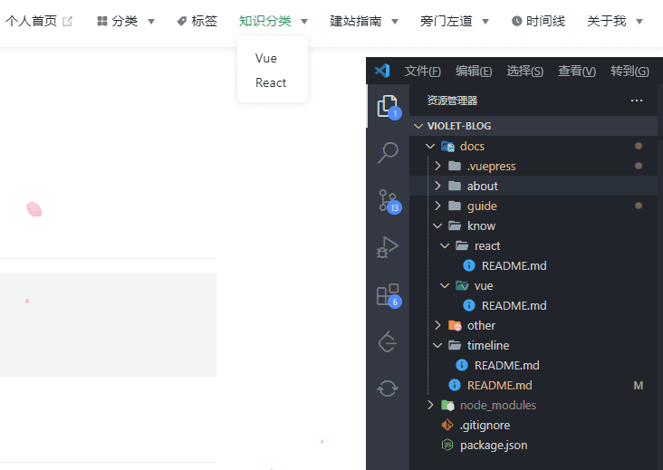

--- 
title: VuePress 搭建
date: 2021-05-21 16:38:46
author: 'Mr.Lan'
sidebar: 'auto'
categories: 
 - 前端
tags: 
 - vue
 - vuepress
publish: true
autoGroup-1: vuepress
autoPrev: vuepress_start
---

博客创建指南第一章
<!-- more -->

***
::: tip
采用vue官方的静态网页生成器

具体信息移至官网 [vuepress](https://vuepress.vuejs.org/zh/)
:::

## **1. 框架搭建**
vuepress官网有详细的安装和引用

在此就不过多介绍，本博客并没有采用最新的vuepress，而是引用了君哥教程的版本

搭建之前建议看下视频[B站：1小时带你搭建vuepress高大上个人博客（极速上手版）](https://www.bilibili.com/video/BV17t41177cr)

## **2. 安装vuepress**
安装好淘宝镜像之后

::: danger 版本注意事项
由于是指定版本安装，这里采用的是1.5.2版本，不保证当前最新版有没有使用区别
:::

``` sh
cnpm install -D vuepress@1.5.2
```
还有一条官方警告
::: danger 注意
如果你的现有项目依赖了 webpack 3.x，我们推荐使用 Yarn (opens new window)而不是 npm 来安装 VuePress。因为在这种情形下，npm 会生成错误的依赖树。
::: 

## **3. 文件目录**
在安装好vuepress之后先确认好文件树的配置

这一项关系着后面菜单导航的分类

在此先把文件分类贴出提供参考

```
.
├─ docs
│  ├─ .vuepress
│  │  ├─ public
│  │  │  ├─ img
│  │  │  ├─ styles
│  │  │  └─ js
│  │  └─ config.js
│  ├─ blog
│  │  ├─ file1.md
│  │  ├─ file2.md
│  │  └─ README.md
│  ├─ ...
│  └─ README.md
├─ .gitignore
└─ package.json
```
+ docs 用于存放整个项目数据
+ .vuepress 存放配置文件
+ public 打包时的静态文件
+ blog 博客内容的分类文件夹
    - 每一个blog文件夹就是顶部导航的一个分类
    - 命名没有需要按照我的"blog"取名
    - blog这类文件夹可以存在多个 就是目录中...的替换
    - 文件夹内部也能够再创文件夹进行二次分类

如还有疑惑可参考本博客的文件夹配置
***

***
在know文件夹有两个子分类对应着顶部子菜单的分类

并且子类文件夹能够点击跳转，因此必须拥有```README.md```文件

::: tip vuepress官网的目录配置（按照自己的需求选择文件夹配置方案）
```
.
├── docs
│   ├── .vuepress (可选的)
│   │   ├── components (可选的)
│   │   ├── theme (可选的)
│   │   │   └── Layout.vue
│   │   ├── public (可选的)
│   │   ├── styles (可选的)
│   │   │   ├── index.styl
│   │   │   └── palette.styl
│   │   ├── templates (可选的, 谨慎配置)
│   │   │   ├── dev.html
│   │   │   └── ssr.html
│   │   ├── config.js (可选的)
│   │   └── enhanceApp.js (可选的)
│   │ 
│   ├── README.md
│   ├── guide
│   │   └── README.md
│   └── config.md
│ 
└── package.json
```
:::
***
::: danger 注意
想要文件夹被识别，生成相应的路由路径

该文件夹必须拥有一个README.md文件，内容可为空，文件的具体用法稍后介绍
:::