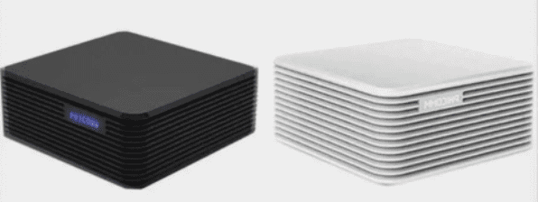

介绍本博客所采用的服务器搭建过程，采用斐讯N1电视盒子自建服务器
<!-- more -->

::: tip
本博客的服务器并没有使用阿里腾讯等服务器运营商，而是采用了开发板进行搭建，价格实惠并且还拥有较为不错的性能，推荐有基础的选购，嫌麻烦建议至服务器商购买，还能省去后续烦恼，如果只是为了搭建博客建议使用GitHub或者Gitee的page功能
:::

参考文章：
1. [N1盒子刷Armbian，看这一篇就够了——Armbian全方位安装指导书](https://post.smzdm.com/p/alpwnxmp/)
2. [斐讯N1 – 完美刷机Armbian教程](https://yuerblog.cc/2019/10/23/%E6%96%90%E8%AE%AFn1-%E5%AE%8C%E7%BE%8E%E5%88%B7%E6%9C%BAarmbian%E6%95%99%E7%A8%8B/)
3. [Armbian-5.77 on N1, so far so good](https://www.right.com.cn/forum/thread-510423-1-1.html)
4. [小白的N1上车记录（N1刷入Armbian5.9.4和EmuELEC）](https://post.smzdm.com/p/aqnl5kz2/)
5. [使用到的工具-山小炮网盘](https://disk.sbsb.fun/)
