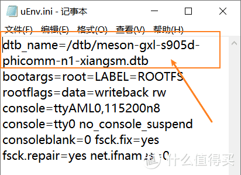
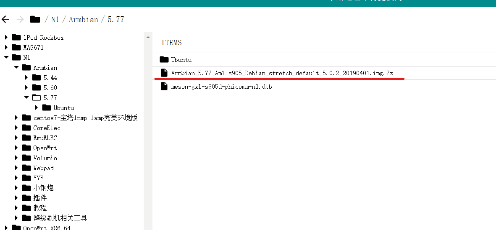

--- 
title: 自建服务器准备工作
date: 2021-08-14
author: 'Mr.Lan'
sidebar: 'auto'
categories: 
 - 服务器
 - 硬件
tags: 
 - debian
 - 斐讯N1
publish: true
# autoGroup-1: 
autoPrev: server_1
---

服务器搭建指南第二章
<!-- more -->
## **1. 材料准备**
服务器搭建需要准备一些基础材料，如果购买已经刷好系统的开发板可以直接跳过

+ 斐讯N1电视盒子
+ usb双头线、N1-T1降刷机助手v1.1（非必须，看情况而定）
+ U盘8G以上（有的U盘会失败，建议多备几个）
+ 显示屏
+ 电脑（能够与盒子处在同局域网）

## **1.1 服务器本体**
服务器选择上有多种选择，树莓派、斐讯N1、斐讯T1，都是不错的选择

这里使用的是斐讯N1电视盒子，作为本来的矿机，低功耗，性能强悍，价格便宜

斐讯N1：
+ ARM64主流架构，真64位linux系统，docker随便玩。
+ 真千兆有线网口，2.4/5G双频wifi，可以作热点。
+ 自带8G的emmc存储，linux系统直接刷到盒子里，不用额外插SD卡，I/O性能好。
+ CPU 4核，2G内存。

如此配置也只需百元就能入手，这还是在如今硬件市场环境下，19年只需70

::: danger 购买建议
1. 现在市面上的N1大部分都已经降过固件，购买时候可以问价商家是否降过固件，降级过能省去大部分麻烦事
2. 部分N1自带商家刷过的系统，这点没有什么要求，N1强悍的地方就在可以随意烧录系统，不会损坏，成砖也能够救回
:::

## **1.2 U盘准备**
准备好U盘，利用镜像烧录工具将系统烧录至U盘

提前将U盘格式化，备份好原来的数据

这里用工具：[Win32磁盘映像工具](http://www.xitongzhijia.net/soft/179174.html)

把系统[Armbian_5.77_Aml-s905_Debian](https://disk.sbsb.fun/)（镜像由山小炮网盘整理）烧录进U盘

山小炮网盘里面还有其他的N1工具能够一并下载下来（请善待网盘，合理使用）

::: tip
目前推荐的烧录系统，就使用Armbian_5.77的版本，这是各个社区大佬推荐最为稳定的版本

至少目前使用来看，的确没有任何问题
:::

烧录之后打开磁盘`BOOT`
::: danger
切忌烧录结束之后电脑弹出格式化 千万不要格式化
:::

`dtb/uEnv.ini` 文件编辑

修改之后将山小炮网盘中N1文件夹中的文件解压

把`meson-gxl-s905d-phicomm-n1-xiangsm.dtb`文件放到ini配置文件对应的目录中

弹出，U盘准备结束

## **1.3 盒子准备**
N1盒子到手之后要先了解它是否已经降级，如果已经刷过其他的系统，就代表已经降级

::: danger
N1盒子降级操作这辈子都只用一次，切忌不能二次降级
:::

如没有降级，请参考[N1盒子刷Armbian，看这一篇就够了——Armbian全方位安装指导书](https://post.smzdm.com/p/alpwnxmp/)进行降级

这里默认购买的盒子已经降级刷上了安卓的电视系统（因为这种状态是市场上最多价格最实惠）

这里不建议采购带有非安卓系统的的盒子，例如小钢炮等

如在后续的刷机中出现变砖，参考[解密：斐讯N1为何火了？分享全套N1救砖指南！](https://www.bilibili.com/video/BV19J411c7Zf?from=search&seid=12767839427503233749)，这个操作可以重复使用，这一点也是N1的强大之处，能够随意烧录

## **2. 准备结束**

+ U盘准备好
+ N1盒子准备好（安卓系统下，或是已降的原生系统）
+ 显示器准备好

以上都准备好之后就可以进入刷入系统的工作
