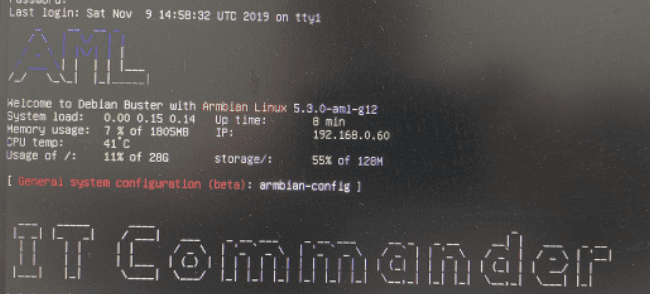

--- 
title: 斐讯N1刷入系统
date: 2021-08-17 10:48:13
author: 'Mr.Lan'
sidebar: 'auto'
categories: 
 - 服务器
 - 硬件
tags: 
 - debian
 - 斐讯N1
publish: true
# autoGroup-1: 
autoPrev: server_2
---

服务器搭建指南第三章

<!-- more -->

## **1. U盘启动**

::: danger
这一步是最为关键的一步，切忌按照步骤操作，注意警告部分
:::

### 1.1 电脑与盒子连接在同一局域网下
准备好网络环境进行后续操作

### 1.2 盒子连接显示器开机
开机脸上显示器，准备键盘和鼠标，空出距离网口最近的USB口

::: danger
距离网口最近的USB口是用来插U盘的

**但是安卓系统启动下无论如何都不可插入U盘，关机状态除外**

**但是安卓系统启动下无论如何都不可插入U盘，关机状态除外**

**但是安卓系统启动下无论如何都不可插入U盘，关机状态除外**
:::

### 1.3 查看盒子的ip地址

原生系统可以直接在显示器上看到ip，已经刷过电视系统的可以在设置中找到ip，实在没找到进入路由器管理查看ip

### 1.4 使用adb工具启动U盘

社区中对于N1的adb工具有两种：
1. 一种是原生的adb工具
2. 一种是对N1盒子适配的再次封装，使用更为简单（第二种的使用方法按照提示使用即可）

这两种都是一样的效果，重启盒子使其进入U盘启动

如果是第一种:
1. 进入adb目录
2. 在文件夹路径上敲cmd进入命令行
3. 输入 `./adb.exe connect 斐讯IP` （如失败ip后面加上`:5555`）
4. 输入 `./adb.exe shell reboot update` 盒子会进入U盘启动并且重启

这里adb的使用可能会有所出入，可以参考之前其他博主的文章

::: danger
第一次的U盘启动不要插入U盘，可以观察显示器的信号灯或者盒子电源，大概熟悉下重启间隔，方便后续操作

**一旦在安卓系统中插入U盘会将盘中系统权限更改，影响后续文件控制，所以一定要在关机后至重启中插入**
:::

整理下来这一步的步骤总结：
+ 电脑使用adb连接盒子
+ 使用指令将盒子进入U盘启动并且重启
+**关机后**至**重启**间隔中插入U盘到离网口最近的USB口

这样重启会自动进入U盘中的系统

::: tip
没有进入系统多半是U盘不适配，只要是电脑控制的自动重启N1盒子那边多半没有问题，换其他U盘重新写入尝试（本人碰到过U盘不适配的问题）
:::

### 1.5 检查系统###

成功进入系统后默认用户：root 密码：1234

可能会提示重置密码，按照提示走即可

完全进入后查看系统文件是否被篡改权限，输入`ls -l /`

文件应该全部属于root用户，如出现1024用户代表已经被污染，关机重刷U盘，重复上述操作

注意U盘插入时机不要太早也不要太晚

## **2. 系统写入eMMC**

等待上述操作没有问题之后就可以将系统写入盒子自带的存储中

输入指令 `nand–sata-install`

等待写入结果，成功后关机拔去U盘就能正常启动了

## **3. 后续优化**

系统搞定之后优化下个方面的配置

### 3.1 换源

编辑`/etc/apt/sources.list`文件更换源

若是 Ubuntu ，将文件内容替换成以下内容：

> deb https://mirrors.tuna.tsinghua.edu.cn/ubuntu-ports/ bionic main restricted universe multiverse
> #deb-src https://mirrors.tuna.tsinghua.edu.cn/ubuntu-ports/ bionic main restricted universe multiverse
> deb https://mirrors.tuna.tsinghua.edu.cn/ubuntu-ports/ bionic-security main restricted universe multiverse
> #deb-src https://mirrors.tuna.tsinghua.edu.cn/ubuntu-ports/ bionic-security main restricted universe multiverse
> deb https://mirrors.tuna.tsinghua.edu.cn/ubuntu-ports/ bionic-updates main restricted universe multiverse
> #deb-src https://mirrors.tuna.tsinghua.edu.cn/ubuntu-ports/ bionic-updates main restricted universe multiverse
> deb https://mirrors.tuna.tsinghua.edu.cn/ubuntu-ports/ bionic-backports main restricted universe multiverse
> #deb-src https://mirrors.tuna.tsinghua.edu.cn/ubuntu-ports/ bionic-backports main restricted universe multiverse

若是 Debian，将文件内容替换成以下内容：

> deb [ arch=arm64,armhf ] https://mirrors.tuna.tsinghua.edu.cn/debian/ stretch main contrib non-free
> #deb-src https://mirrors.tuna.tsinghua.edu.cn/debian/ stretch main contrib non-free
> deb [ arch=arm64,armhf ] https://mirrors.tuna.tsinghua.edu.cn/debian/ stretch-updates main contrib non-free
> #deb-src https://mirrors.tuna.tsinghua.edu.cn/debian/ stretch-updates main contrib non-free
> deb [ arch=arm64,armhf ] https://mirrors.tuna.tsinghua.edu.cn/debian/ stretch-backports main contrib non-free
> #deb-src https://mirrors.tuna.tsinghua.edu.cn/debian/ stretch-backports main contrib non-free
> deb [ arch=arm64,armhf ] https://mirrors.tuna.tsinghua.edu.cn/debian-security/ stretch/updates main contrib non-free
> #deb-src https://mirrors.tuna.tsinghua.edu.cn/debian-security/ stretch/updates main contrib non-free
> #deb [ arch=arm64,armhf ] https://mirrors.tuna.tsinghua.edu.cn/debian/ sid main contrib non-free

更新下：输入`apt-get update`和`apt-get upgrade`

::: danger
`apt-get upgrade` 的提示中有个选项要选择 NO
:::

### 3.2 更新时间

`ln -sf /usr/share/zoneinfo/Asia/Shanghai /etc/localtime && echo "Asia/Shanghai" > /etc/timezone`

### 3.3 网络优化

这方面按照自己的需求进行修改，可以固定，也可以自动分配，还能去除网线配置WiFi

## 4. 总结

到此N1改服务器的步骤就全部完成了

剩余的按照自己无服务的要求去配置自己需要的环境