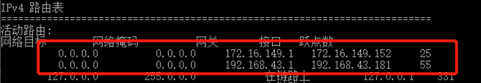

--- 
title: 为远程调试内网电脑配置双网络环境
date: 2022-07-20 09:12:41
author: 'Mr.Lan'
sidebar: 'auto'
categories: 
 - 服务器
 - 网络
tags: 
 - linux
 - nginx
publish: true
# autoGroup-2: 
# autoPrev: 
---
通过对一台内网的用户电脑配置使其可以通过互联网远程的同时拥有特殊内网（例如政府 10 17 等网段）访问的能力

<!-- more -->

## 问题复现
有时候项目部署在特殊的内网环境中，开发人员需要远程访问**应用（非服务器**）进行问题定位。在没有vpn的情况下只能通过互联网远程一台 **window** 电脑查看应用，可是一旦内网的一台电脑连上了互联网就会失去内网访问的能力，这时候就可以对他进行配置使其拥有互联网和内网两个网络。

## 问题解决

1. 首先我们需要让一台内网的用户电脑需要拥有两张网卡，一张默认的插线的**走内网环境**不用动，一个 **USB-wifi** 连接互联网
2. 管理员打开 **cmd**
3. 输入 `route print` 查看当前 **四个零（即对所有IP的访问）** 访问经过的网关

4. 两个网关一个是内网一个是刚刚插上WiFi所连接路由器的外网网关，分不清不确认可以到控制面板中的网络适配器中查看WiFi或者内网的网关对比下，记住这两个网关和他们的子网掩码
5. 删除旧的规则 `route delete 0.0.0.0` ，这时候应该是没有任何访问能力
6. 新增互联网访问 `route -p add 0.0.0.0 mask 子网掩码 互联网网关`，根据自身网络替换内容。这行含义就是将所有网络访问都交给互联网的网关处理
7. 再新增内网访问 `route -p add 想要访问的ip mask 子网掩码 内网网关`，想要访问的ip就是只有在内网才能上的应用地址，表示将此IP交给内网网关管理

就此这台电脑就拥有了两个网络环境，关机之后网络就会重置