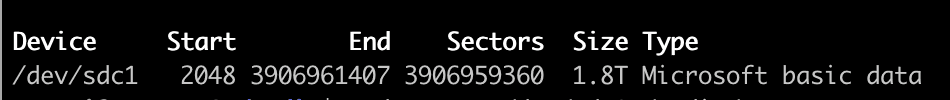

--- 
title: linux类系统（debian、ubuntu）下挂载新硬盘
date: 2022-03-31 11:39:20
author: 'Mr.Lan'
sidebar: 'auto'
categories: 
 - 服务器
tags: 
 - debian
 - ubuntu
 - linux
 - 指令
 - 挂载硬盘
publish: true
# autoGroup-1: 
# autoPrev: 
---

## linux系统挂载硬盘至某个目录

先查看插上的硬盘信息
``` sh
fdisk -l
```



创建一个新的文件夹

``` sh
mkdir /home/ssd
```

再将磁盘挂载至此目录

``` sh
mount /dev/sdc1 /home/ssd
```

这样就能够在 `ssd` 文件下下查看修改磁盘的内容了

## linux开机自动挂载硬盘

如果要将硬盘设置成为自动加载, 则需要修改文件`/etc/fstab`. 如果我们要将硬盘`/dev/sdc1`挂载到文件夹/home下, 则我们需要首先查询`/dev/sdc1`对应的`UUID`. 查询硬盘的`UUID`的命令如下:

``` sh
blkid
```

查看到`UUID`和`type`后（手上没有设备无法截图(●ˇ∀ˇ●)）将命令加入到文件/etc/fstab中:

+ $1 UUID的值
+ $2 type的值

 `UUID=$1 /home/ssd $2 defaults 0 0` 

1. `UUID=$1` 设备名 也可以 `/dev/sdb1`
2. `/home/ssd` 挂载点
3. `ext4`($2) 文件系统 一般是(ext加数字)
4. `defaults` 特定参数选项(通常使用defaults),
    + ro 以只读模式加载该文件系统
    + sync 不对该设备的写操作进行缓冲处理，这可以防止在非正常关机时情况下破坏文件系统，但是却降低了计算机速度
    + user 允许普通用户加载该文件系统
    + quota 强制在该文件系统上进行磁盘定额限制
    + noauto 不再使用mount -a命令（例如系统启动时）加载该文件系统
5. `0` 检查文件系统应该以多快频率进行转储(0不需要转储)
6. `0` fsck启动时被扫描的顺序，根文件系统/对应该字段的值应该为1，其他文件系统应该为2。(0启动时不扫描)

保存后退出，运行 `mount -a` 重新加载硬盘