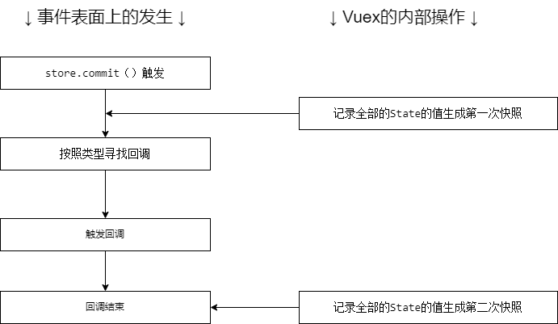

--- 
title: 利用VueX管理全局数据（二）
date: 2022-03-18 13:51:38
author: 'Mr.Lan'
sidebar: 'auto'
categories: 
 - 前端
tags: 
 - vue
 - vuex
 - store
publish: true
# autoGroup-2: 知识点
autoPrev: vue_vuex1
---

第二篇 讲述VueX的使用时的写法和各个结构方法
<!-- more -->

## **1. VueX的安装**

在vuecli脚手架构建的项目下运行

``` sh
npm install vuex@next --save
```

其他方式可见[官网](https://vuex.vuejs.org/zh/installation.html)

## **2. VueX的核心概念**

简述VueX的核心的基本概念

+ State
    - 存放状态
    - 使用 `mapState` 辅助函数批量取状态
+ Getter
    - 从 store 中的 state 中获取处理版状态
    - 使用 `mapGetters` 辅助函数批量获取处理版状态
+ Mutation
    - 变更、更新状态
    - 同步提交
    - 使用 `mapMutations` 辅助函数提交
+ Action
    - Action 类似于 mutation
    - 可以异步
    - Action 是触发 mutation 进行提交
+ Module
    - 分割模块
    - 最后合并进 store

### 2.1 VueX - State

State 作为VueX的对象管理，存放着我们申明的状态

---

Vuex 使用单一状态树，代表着着每个应用将仅仅包含一个 store 实例，全部都在 `this.$store` 一个对象中

::: tip
Vuex 通过 Vue 的插件系统将 store 实例从根组件中“注入”到所有的子组件里，所以在任何组件都能够通过`this.$store`获取到VueX实例出的状态
:::

通常情况我们在组件的 `computed` 中使用VueX的状态

这样保证了状态更新了能够获取最新的状态

``` js
const Counter = {
  template: `<div>{{ count }}</div>`,
  computed: {
    count () {
      return this.$store.state.count
    }
  }
}
```

### 2.1.1 State 的辅助函数 mapState

当一个组件内的 computed 需要调取非常多的状态时，按照以往就需要写非常多的方法 返回出所对应的状态，这样重复的代码就能够通过辅助函数来快捷实现

``` js
// 在单独构建的版本中辅助函数为 Vuex.mapState
import { mapState } from 'vuex'

export default {
  // ...
  computed: mapState({
    // 方式一 箭头函数可使代码更简练
    count: state => state.count,

    // 方式二 传字符串参数 'count' 等同于 `state => state.count`
    countAlias: 'count',

    // 方式三 为了能够使用 `this` 获取局部状态，必须使用常规函数
    countPlusLocalState (state) {
      return state.count + this.localCount
    }
  })
}
```

+ 方式一 应对直接取值
+ 方式二 应对需要更改名字
+ 方式三 应对需要和当前组件进行计算后返回

---

更常见的情况是，方式一：

``` js
computed: mapState(['count'])
```

直接取出状态将 this.count 映射为 store.state.count

---

当组件本身存在计算属性时候，使用ES6的扩展运算符将 mapState 展开混入 computed 中：

``` js
computed: {
  localComputed () { /* ... */ },
  // 使用对象展开运算符将此对象混入到外部对象中
  ...mapState({
    // ...
  })
}
```


### 2.2 VueX - Getter

通常情况下我们能够使用 State 功能的 `this.$store.state` 来取得状态

但是有时候需要的某种状态是 State 处理后的数据，例如列表进行过滤并计数：

``` js
computed: {
  doneTodosCount () {
    return this.$store.state.todos.filter(todo => todo.done).length
  }
}
```

这种情况下每个组件需要 `doneTodosCount` 都要写一段长代码，不够人性化，因此就有了 Getter

它能够将状态进行二次封装后返回出我们想要的结果，在VueX的定义中：

``` js
const store = createStore({
  state: {
    todos: [
      { id: 1, text: '...', done: true },
      { id: 2, text: '...', done: false }
    ]
  },
  getters: {
    doneTodos: (state) => {
      return state.todos.filter(todo => todo.done)
    }
  }
})
```

需要 `doneTodos` 的组件可以通过 Getter 取得状态

``` js
this.$store.getters.doneTodos // -> [{ id: 1, text: '...', done: true }]
```

---

Getter 也能够使用其他 getter 作为第二个参数：

``` js
getters: {
  // ...
  doneTodos: (state) => {
    return state.todos.filter(todo => todo.done)
  },
  doneTodosCount (state, getters) {
    return getters.doneTodos.length
  }
}
```

---

当然有从外部传参再进行处理状态的需求

Getter 也能够接收调用者的参数:

``` js
getters: {
  // ...
  getTodoById: (state) => (id) => {
    return state.todos.find(todo => todo.id === id)
  }
}
```

``` js
this.$store.getters.getTodoById(2) // -> { id: 2, text: '...', done: false }
```

### 2.2.1 Getter 的辅助函数 mapGetter

Getter 的辅助函数与之前 State 的辅助函数 mapState 没有什么区别，依旧是一样的使用方式


### 2.3 VueX - Mutation

前两节的 State 与 Getter 作为对外部而使用的状态取出

Mutation 就是对于 VueX 内部而产生的  **提交载荷（Payload）** ，简单说就是更新状态

在 VueX 的定义中：

``` js
// ...
mutations: {
  increment (state, n) {
    state.count += n
  }
}
```

每个 mutation 都有一个字符串的**事件类型 (type)**和一个**回调函数 (handler)**。这个回调函数就是我们实际进行状态更改的地方，并且它会接受 state 作为第一个参数

你不能直接调用一个 mutation 处理函数。这个选项更像是事件注册：“当触发一个类型为 increment 的 mutation 时，调用此函数。”要唤醒一个 mutation 处理函数，你需要以相应的 type 调用 store.commit 方法

使用：

``` js
// 基础提交
store.commit('increment', 10)

// 提交对象
store.commit('increment', {
  amount: 10
})

// 对象方式提交
store.commit({
  type: 'increment',
  amount: 10
})
```

::: danger 注意
mutation 下的每一个方法都是回调方法，是 `store.commit` 的回调，因此方法内**严禁使用异步方法**去更新 state 的值
:::

原因的话，设想下：

我们要通过 devtools 捕捉一个状态的**前一状态**和**后一状态**的快照：



1. `store.commit` 触发可以获取前一状态
2. 回调触发 mutation 内对应的方法
3. 回调已经执行结束，方法内部真正的更新却在异步中实现
4. 按照 非异步方法（同步方法） 的情况下
5. devtools 可以捕捉 后一状态 取得新值，但是异步情况下 根本无法知道什么时候结束异步，所以快照依旧是取得旧值
6. 两次值进行对比寻找差异，追踪到更新的目标

::: danger 注意
实质上任何在回调函数中进行的状态的改变都是不可追踪的。

可以理解为追踪是顺序记录产生的结果，而异步算是插叙

想要正确追踪除非将追踪的后面步骤注入异步操作中

这样整体看下来才能算是按顺追踪
:::

异步的更新状态参考 [Action](#_2-4-vuex-action)

### 2.3.1 Mutation 的辅助函数 mapMutations

Mutation 的辅助函数与之前 State 的辅助函数 mapState 没有什么区别，依旧是一样的使用方式

只不过不在 computed 计算属性中使用，Mutation 是方法，因此是加入 methods 属性中：

``` js
import { mapMutations } from 'vuex'

export default {
  // ...
  methods: {
    ...mapMutations([
      'increment', // 将 `this.increment()` 映射为 `this.$store.commit('increment')`

      // `mapMutations` 也支持载荷：
      'incrementBy' // 将 `this.incrementBy(amount)` 映射为 `this.$store.commit('incrementBy', amount)`
    ]),
    ...mapMutations({
      add: 'increment' // 将 `this.add()` 映射为 `this.$store.commit('increment')`
    })
  }
}
```


### 2.4 VueX - Action

对于异步修改状态的方式，Vuex 也提供了 Action 方法

其实本质就是提供一个方法，方法内自行调用 Mutation 的 commit 事件，就是允许把异步的操作提至外侧，本质的 commit 依旧是同步执行，简单示例：

``` js
const store = createStore({
  state: {
    count: 0
  },
  mutations: {
    increment (state) {
      state.count++
    }
  },
  actions: {
    increment (context) {
      context.commit('increment')
    }
    // 或者 参数解构 来简化代码
    increment ({commit}) {
      commit('increment')
    }
  }
})
```

形参 context 带有 Vuex 下的方法，例如 `context.state` 和 `context.getters` 可以获取状态

---

触发方式 通过 `store.dispatch('increment')`，相比 Mutation 在 Action 的内部允许**异步**

``` js
actions: {
  incrementAsync ({ commit }) {
    setTimeout(() => {
      commit('increment')
    }, 1000)
  }
}
```

### 2.4.1 Action 的辅助函数 mapAction

Action 的辅助函数与 Mutation 的辅助函数 mapMutation 没有什么区别，依旧是一样的使用方式


### 2.5 VueX - Module

为了应对过大的 Vuex 状态树，模块化管理 Module 产生了：

``` js
const moduleA = {
  state: () => ({ ... }),
  mutations: { ... },
  actions: { ... },
  getters: { ... }
}

const moduleB = {
  state: () => ({ ... }),
  mutations: { ... },
  actions: { ... }
}

const store = createStore({
  modules: {
    a: moduleA,
    b: moduleB
  }
})

store.state.a // -> moduleA 的状态
store.state.b // -> moduleB 的状态
```

将多个模块分开管理，合并至一个 store 对象中，模块之间也能够互相获取、更新状态

### 2.5.1 VueX中Module局部状态

对于模块内部的 mutation 和 getter 和 actions接收参数多了**根节点（rootState）的接收**：

``` js
const moduleA = {
  state: () => ({
    count: 0
  }),
  mutations: {
    increment (state) {
      // 这里的 `state` 对象是模块的局部状态
      state.count++
    }
  },

  getters: {
    doubleCount (state) {
      return state.count * 2
    },
    sumWithRootCount (state, getters, rootState) {
      return state.count + rootState.count
    }
  },

  actions: {
    incrementIfOddOnRootSum ({ state, commit, rootState }) {
      if ((state.count + rootState.count) % 2 === 1) {
        commit('increment')
      }
    }
  }
}
```

::: warning
关于 **模块嵌套**，**命名空间** 的解读和问题建议参考[官网](https://vuex.vuejs.org/zh/guide/modules.html#%E5%91%BD%E5%90%8D%E7%A9%BA%E9%97%B4)，我对于此块的理解依旧存在疑问就不记录自身的理解
:::

## **3. VueX知识点小结**

Vuex 方便了我们对于公共状态的使用

本身也提供了：
+ 声明状态
+ 获取状态
+ 获取加工状态
+ 修改状态
+ 异步处理后修改状态等多种方法

模块的管理方式也更加方便了我们对于各个需求功能分块管理

接下来讲讲几个简单的 Vuex 的[使用场景](./vue_vuex3.md)


