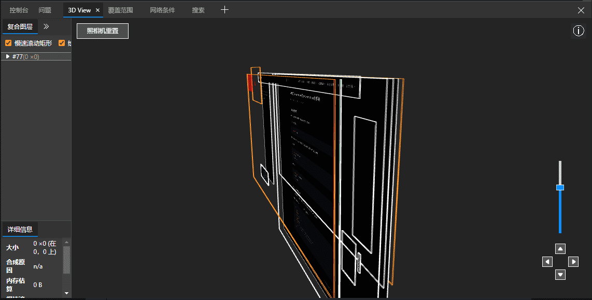

BFC(Block formatting context)直译为"块级格式化上下文"。它影响标签之间的位置关系。[转载](https://blog.csdn.net/sinat_36422236/article/details/88763187)
<!-- more -->

## BFC 块级格式化上下文

网页视图的构成石油多个盒子（box）排列组成，`html` 的 `dom` 就是一棵由 `box` 组成的树

网页的最终排列效果由：

+ `dom` 自身 `box` 模式
+ 元素之间关系 `Formatting Context`

两大因素决定

### Box：css布局的基本单位

元素的 `box-size` `display` 决定了自身以什么样的方式设置大小，设置自身的行内还是块状，不同的 `box` 类型也决定了参与不同的 Formatting Context（一个决定如何渲染文档的容器）

### Formatting Context

Formatting context 是 W3C CSS2.1 规范中的一个概念。它是页面中的一块渲染区域，并且有一套渲染规则，它决定了其子元素将如何定位，以及和其他元素的关系和相互作用。最常见的 Formatting context 有 Block fomatting context (简称BFC)和 Inline formatting context (简称IFC)。

> BFC是一个独立的布局环境，其中的元素布局是不受外界的影响，并且在一个BFC中，块盒与行盒（行盒由一行中所有的内联元素所组成）都会垂直的沿着其父元素的边框排列。

## BFC的布局规则

+ 内部的Box会在垂直方向，一个接一个地放置。
+ Box垂直方向的距离由margin决定。**属于同一个BFC的两个相邻Box的margin会发生重叠**。
+ 每个盒子（块盒与行盒）的margin box的左边，与包含块border box的左边相接触(对于从左往右的格式化，否则相反)。即使存在浮动也是如此。
+ BFC的区域不会与float box重叠。
+ BFC就是页面上的一个隔离的独立容器，容器里面的子元素不会影响到外面的元素。反之也如此。
+ 计算BFC的高度时，浮动元素也参与计算。

## 如何创建BFC

1. float的值不是none。
2. position的值不是static或者relative。
3. display的值是inline-block、table-cell、flex、table-caption或者inline-flex
4. overflow的值不是visible

## BFC的作用

1. 利用BFC避免margin重叠
2. 自适应两栏布局
3. 清除浮动

详细的例子可以直接看[原文](https://blog.csdn.net/sinat_36422236/article/details/88763187)，非常详细
