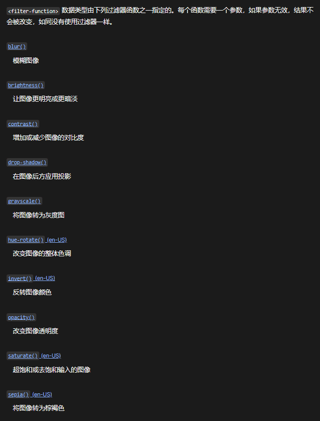

利用CSS的`filter`属性做黑夜白昼模式
<!-- more -->

正常：


反转：

***

## **filter**
``` css
filter: invert(100%) contrast(87%);
```
或者
``` css
filter: grayscale(100%);
```
在html上增加此样式即可以做到亮色主题反转为黑夜模式

::: waring 缺点
图片和视频也会被翻转颜色
:::

***
time：2023-01-31 09:49:21 补充内容

MDN对以上语句的描述

:::
The grayscale() CSS function converts the input image to grayscale. Its result is a .
:::

意思是 grayscale 是一个函数，filter 会按照要求返回过滤后的结果。

filter 还支持其他条件过滤处理


