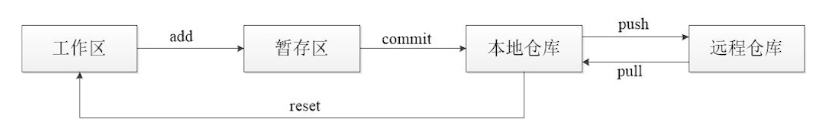

--- 
title: git入门常用指令
date: 2022-03-11 13:20:11
author: 'Mr.Lan'
sidebar: 'auto'
categories: 
 - 服务器
tags: 
 - git
publish: true
# autoGroup-1: 
# autoPrev: 
---

记录git常用指令
<!-- more -->

## **1. git管理仓库方式**

1. git 会把用户所做的修改暂存
2. 用户确定修改提交至本地仓库
3. 本地仓库和远程仓库对比 没有冲突后便可以提交至远程

---

::: tip
相比与svn多了一个本地仓库的，用户的修改都是对应本地仓库，冲突解决也是本地仓库对远程仓库，相比于svn的直接操控唯一远程仓库，各有优缺点
:::

## **2. 七个常用指令**

1. `git init` 初始化本地仓库
2. `git add` 将文件提交至本地暂存区
3. `git commit -m` 暂存区提交至本地仓库
4. `git remote add [shortname] [url]` 链接远程仓库地址增加别名
5. `git push -u [shortname] master` 本地仓库提交至别名对应的远程仓库
6. `git pull` 远程仓库同步至本地仓库
7. `git clone` 克隆某个仓库至本地