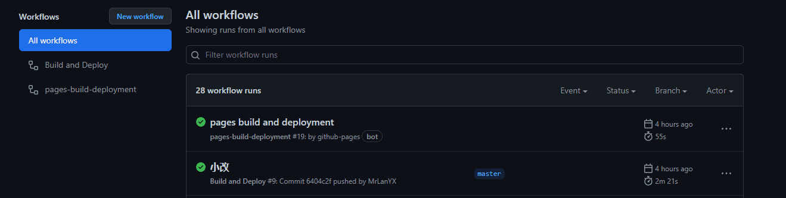

--- 
title: GitHub Action 提交代码自动构建前端项目
date: 2022-05-06 13:48:17
author: 'Mr.Lan'
sidebar: false
categories: 
 - 前端
 - 服务器
tags: 
 - git
 - vuepress
publish: true
---

利用 GitHub Action 工作流提交代码触发自动构建，例如写完博客提交后自动打包至 GitHub page 预设好的分支中
<!-- more -->

***

在项目所在的根目录创建文件 `.github\workflows\ci.yml`，具体内容如下：

``` yml
name: Build and Deploy # 工作流名称，随意取
on: 
  push:
    branches:
      - master # 表示 master 分支触发此工作流
jobs:
  build-and-deploy:
    concurrency: ci-${{ github.ref }} # Recommended if you intend to make multiple deployments in quick succession.
    runs-on: ubuntu-latest # 构建时使用的系统
    steps:
    # 第一步
      - name: Checkout 🛎️ 
        uses: actions/checkout@master # 检出目标分支
    # 第二步
      - name: Install and Build 🔧 # 拉取依赖 && 构建打包文件
        run: |
          npm ci
          npm run build
    # 第三步
      - name: Deploy 🚀
        uses: JamesIves/github-pages-deploy-action@v4.3.3 # 使用 JamesIves 工具针对 github-pages 功能提交分支
        with:
          branch: build # 提交到当前仓库的分支名
          folder: dist # 提交时选择的物理文件路径
```

完成后每次提交到 master 分支都会触发工作流，自动完成 github-pages 所需要的分支要求