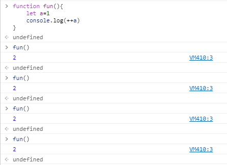
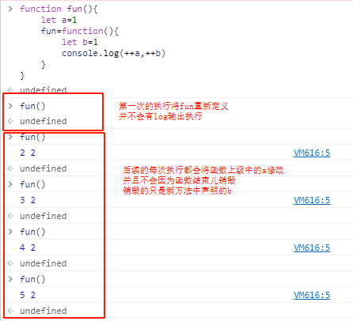

--- 
title: js的闭包形成与利用
date: 2021-07-03 10:39:32
author: 'Mr.Lan'
sidebar: 'auto'
categories: 
 - 前端
tags: 
 - js
 - 闭包
 - 作用域
 - 销毁
publish: true
# autoGroup-2: 
---
> 由于[js地址引用](./js_address.md)文章而顺带记录js中的闭包原理
<!-- more -->
## **1. 闭包概念**
+ 它是一种保护机制，保护里边的变量不受外界的影响
+ 函数执行，形成一个私有作用域，这个私有作用域就是闭包
+ 不销毁的私有作用域才是闭包
+ 能够带来私有作用域的好处，也能产生堆垃圾

## **2. 闭包形成**
+ 一个函数执行时，内部定义的变量在普遍情况下会在结束函数后销毁
+ 但是如果在函数内部中出现了栈的引用，函数执行的步骤就不能被销毁
+ 函数销毁会导致栈中的引用丢失，可参考[文章销毁](./xiao_hui.md)
+ 通俗点就是函数套函数，就能形成闭包（不完全是）

例如：
``` js {3-6}
function fun(){
    let a=1
    fun=function(){
        let b=1
        console.log(++a,++b)
    }
}
```
在以上方法`fun()`中，如果没有`fun()`的重新引用，正常执行每次变量`a`会重新销毁再申明


+ 但是在函数内部对本身进行重新引用至新的堆地址，将本身重定义
+ 在函数的第一次执行之后本身就被指向原方法地址中的一个新地址
+ 由此就导致原方法中的`a`变量没被销毁，并且能够被新的`fun()`向上查找找到
+ 并且变量`a`又不会污染外部参数，`a`就成为了`fun()`的私有变量


闭包的形成方式不一定要对自身重新定义

返回值的方式一样可行，但为了防止销毁需要栈中变量引用

``` js
function fun(){
    let a=1
    return function(){
        let b=1
        console.log(++a,++b)
    }
}
let fun2=fun()
```
执行`fun2()`与原先的`fun()`是一致的效果

## **3. 作用域销毁问题**

### 栈内存销毁
销毁，当这个作用域没有用处时，就销毁；没有用：跟外界没有任何关系了，就是外部不调用栈内存里面代码，变量时，栈内存销毁；

### 私有作用域销毁
函数执行完成之后，看这个作用域是否还有用处，别的地方是否调用私有作用域里面的代码，变量，没有用就直接销毁

### 全局作用域销毁
只有在关闭页面的时候销毁

### 垃圾回收机制
谷歌 采用 计时查询的方式， 定期查询一遍，把没有被占用的堆内存销毁
IE和火狐 采用 计数的方式； 当有一个变量占用这个地址时 我就计数加一；当有有一个变量不再占用这个堆内存，我就计数减一