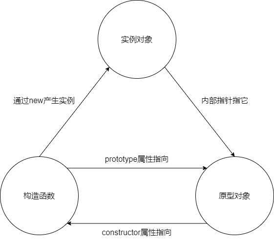
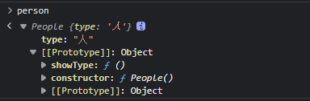

> 用通俗易懂的方式讲述 <font color="#dd0000"> **构造函数**，**对象原型**，**实例对象** </font> 三者之间关系
<!-- more -->

我们首先要了解构造函数，原型对象，实例对象分别是什么：

1. **构造函数**作为一个函数，里面可以操作 `this` 所指向的对象并且在实例（new操作）后返回 `this` ，返回后就是**实例对象**，每一次 `new` 就会生成一个实例。
2. 每创建一个函数，该函数都会自动带有一个 `prototype` 属性。该属性是一个指针，指向一个对象，该对象称之为**原型对象**。
3. 原型对象上默认有一个属性 `constructor` ，该属性也是一个指针，指向其相关联的**构造函数**。



总结就是：

+ **构造函数** 和 **原型对象** 都有一个属性可以指向对方
+ **构造函数** 实例后会生成一个 **实例对象**
+ **实例对象** 通过内部指针指向原型对象，可以调用 **原型对象** 上的方法

::: danger
实例对象只是通过内部指针指向原型对象，并不是指原型对象的属性也是他的属性

例如以下示例中 `person.showType()` 虽然能够调用到，但是 `showType()` 并非是实例的属性，它的属性只有在构造时构造函数内给它加上的 `type`


:::

示例：

``` js
// 首先申明一个 构造函数
function People(){
    this.type='人'
}
// 在其原型对象上申明一个方法
People.prototype.showType=function(){
    console.log(this.type);
}
// 顺便验证构造函数和原型对象是否能互相指向
console.log(People.prototype.constructor==People); // true
// 实例下构造函数产生一个实例对象
var person=new People();
//调用原型对象上面的方法
person.showType(); // 人
```

::: danger
People.prototype只是一个指针，指向的是原型对象，利用这个指针构成[原型链](./prototypelian)可以帮助我们实现js继承
:::
