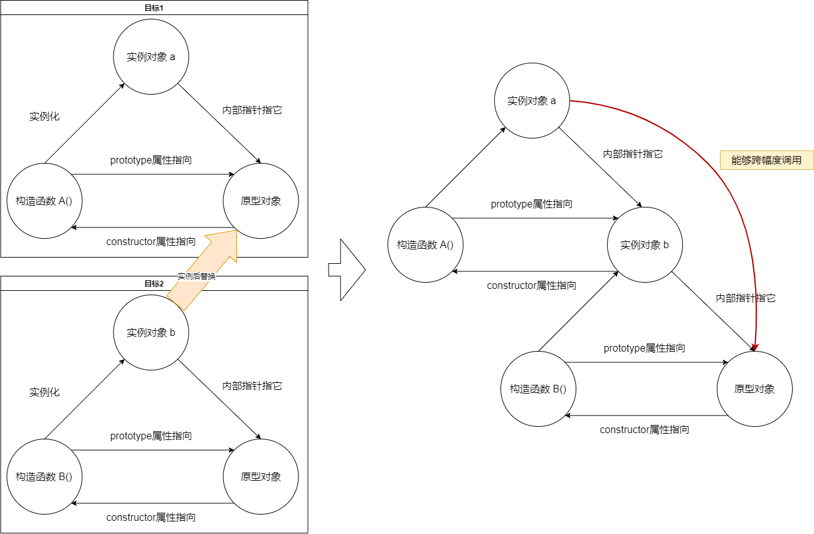

在[构造函数，对象原型，实例对象三者之间的关系](./new_prototype_fun)文章中讲解了三者关系


里面强调了实例对象可以通过**内部指针**指向原型对象，这个原型对象又是构造函数的伴生物，三者之间就没有外部的介入都是内部关系

***

但是：

如果在构造实例之前，将构造函数的原型指向一个已经存在的实例，那这个修改过后的构造函数所生成的实例，就会有一个内部指针指向那个事先准备的实例



最终

实例能透过内部指针调取`事先准备的实例`的属性，还能再通过`事先准备的实例`的内部指针调用别的构造函数下的原型对象

示例：

``` js
function A(){
    this.aValue="A"
}
function B(){
    this.bValue="B"
}
B.prototype.log=function(){
    console.log(this.aValue,this.bValue);
}
A.prototype = new B()
let a = new A()

a.aValue // A
a.bValue // B
a.log() // A,B 先是向下查找 B 原型对象上的 log() 方法，然后向上查找找到 a 实例的 aValue 属性
```

***

原型链可以一直套，就能够实现 JavaScript 继承的效果了
