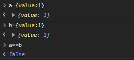
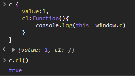
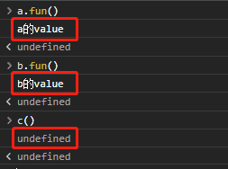
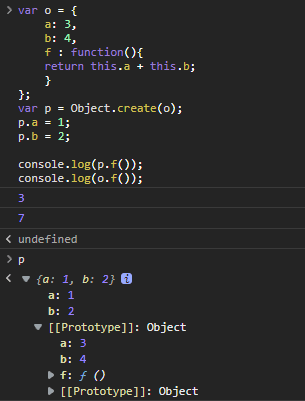

## 1. 前端的 this 是什么

this 指向问题是入坑前端**必须**了解知识点，它是JavaScript中的一个关键字，代表变量申明时不能用 this

``` js
// 错误的申明
var this={}
let this={}
const this={}
```

`this` 是**指向**一个**对象**，它是谁依赖于函数调用的上下文条件，与函数被调用的方式有关。

常见的几种产生 `this` 的环境：
+ 在非箭头函数下， `this` 指向调用其所在函数的对象，而且是离谁近就是指向谁（此对于常规对象，原型链， getter & setter等都适用）
+ 构造函数下， `this` 与被创建的新对象绑定
+ DOM事件， `this` 指向触发事件的元素
+ 内联事件分两种情况，bind绑定， call & apply 方法等
+ 箭头函数。

---

## 2. 全局状态下的 this 

::: tip 先决条件
一个对象作为复杂数据，等号赋值是一个地址应用，所以即便是相同内容的不同对象也不会相等



由此我们就能通过 `==`或者`===` 来判断 `this` 指向谁，例如：


:::

在全局环境下， `this` 始终指向全局对象（window）, 无论是否严格模式：

``` js
console.log(this.document === document); // true

// 在浏览器中，全局对象为 window 对象：
console.log(this === window); // true

this.a = 37;
console.log(window.a); // 37
```

## 3. 函数内的 this 

全局模式下函数内的 `this` ，直接调用有**严格模式**和**非严格模式**区别：

``` js
function f1(){
  return this;
}

f1() === window; // true

function f2(){
  "use strict"; // 这里是严格模式
  return this;
}

f2() === undefined; // true
```

+ 非严格模式 直接调用 `this` 指向 `windows`
+ 严格模式 直接调用 `this` 不存在

## 4. 对象中的 this 变化情况

如果函数的调用方式不是在windows下，而是被对象调用，那 `this` 的指向就会不同

`this` 指向谁，完全是由函数**被调用的调用点**来决定的，也就是不同调用者函数内的 `this` 指向也会不同，它写出后并不是一个固定的值

``` js
function logValue() {
    console.log(this.value);
}
let a={
    value:"a的value",
    fun:logValue
}
let b={
    value:"b的value",
    fun:logValue
}
let c=a.fun
```

这三种情况下去调用 `logValue` 都会有不同的结果：



1. `a.fun()` this 指向对象 a
2. `b.fun()` this 指向对象 b
3. `c()` this 指向对象 windows

关于对象调用函数产生的 `this` 指向谁，记住一个技巧，在函数调用的完整方式上，`.`上一个是谁 `this` 就是指向谁

+ `a.fun()`、`b.fun()` 分别指向 a 和 b
+ `c()` 写完整就是 `windows.c()` 指向 windows

## 5. 原型链中 this

如果一个对象没有对应的方法，则会向原型链上查找方法

``` js
var o = {
    a: 3,
    b: 4,
    f : function(){ 
    return this.a + this.b; 
    }
};
var p = Object.create(o);
p.a = 1;
p.b = 2;

console.log(p.f()); // 3
console.log(o.f()); // 7
```

+ 在执行 `p.f()` 的时候，`p` 对象并没有 `f` 属性，向原型链上查找，找到后返回的 `this` 还是指向调用者 `p`
+ 在执行 `o.f()` 的时候，调用者是 `o` 返回的 `this` 指向它



## 6. 构造函数中 this

构造器内可以对 `this` 操作，并且返回，也可以指定返回一个对象作为 `this` ，如果返回的不是对象默认返回 `this`

``` js
function C(){
  this.a = 1;
}

var o = new C();
console.log(o.a); // logs 1


function C2(){
  this.a = 2;
  return {a:4};
}

var b = new C2();
console.log(b.a); // logs 4


function C3(){
  this.a = 3;
  return "4";
}

var q = new C3();
console.log(q.a); // logs 3
```

::: tip
C2 中对 `this.a` 的赋值完全没有影响可以忽略

C3 中的 return 没有效果可以忽略
:::

---

js中主要的 `this` 就是对象和构造器使用

DOM事件、内联事件、bind绑定、 call & apply 方法、箭头函数等后续再讲