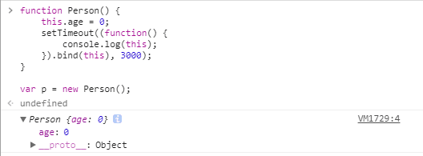

接上之前 [this讲解](./this.md)，补上 call & apply 方法、bind绑定、DOM事件、内联事件、箭头函数的this指向问题。[转载（this 指向详细解析（箭头函数））](https://www.cnblogs.com/dongcanliang/p/7054176.html)
<!-- more -->

## call & apply 中的this指向

当函数通过Function对象的原型中继承的方法 call() 和 apply() 方法调用时， 其函数内部的this值可绑定到 call() & apply() 方法指定的第一个对象上， 如果第一个参数不是对象，JavaScript内部会尝试将其转换成对象然后指向它。

``` js
function add(c, d){
    return this.a + this.b + c + d;
}

var o = {a:1, b:3};

add.call(o, 5, 7); // 1 + 3 + 5 + 7 = 16

add.apply(o, [10, 20]); // 1 + 3 + 10 + 20 = 34

function tt() {
    console.log(this);
}
// 返回对象见下图（图1）
tt.call(5);  // Number {[[PrimitiveValue]]: 5} 
tt.call('asd'); // String {0: "a", 1: "s", 2: "d", length: 3, [[PrimitiveValue]]: "asd"}
```


## bind方法中的this

bind方法在ES5引入， 在Function的原型链上， `Function.prototype.bind` 通过bind方法绑定后， 函数将被永远绑定在其第一个参数对象上， 而无论其在什么情况下被调用。

``` js
function f(){
    return this.a;
}

var g = f.bind({a:"azerty"});
console.log(g()); // azerty

var o = {a:37, f:f, g:g};
console.log(o.f(), o.g()); // 37, azerty（g.()内的this永远指向bind内的对象）
```

## dom事件中的this

1. 当函数被当做监听事件处理函数时， 其 `this` 指向**触发该事件**的DOM元素（针对于 addEventListener 类事件）
2. 当代码被内联处理函数调用时，它的 `this` 指向监听器所在的DOM元素（针对标签上的 onclick 类事件）
3. 当代码被包括在函数内部执行时，其 `this` 指向等同于**函数直接调用**的情况，即在非严格模式指向全局对象window，在严格模式指向undefined

内联事件：

控制台输出


## setTimeout & setInterval 中的this

定时器中调用函数的 `this` 默认指向 `window`，也可以通过 `bind` 指向自定义

``` js
//默认情况下代码
function Person() {  
    this.age = 0;  
    setTimeout(function() {
        console.log(this);
    }, 3000);
}

var p = new Person();//3秒后返回 window 对象
==============================================
//通过bind绑定
function Person() {  
    this.age = 0;  
    setTimeout((function() {
        console.log(this);
    }).bind(this), 3000);
}

var p = new Person();//3秒后返回构造函数新生成的对象 Person{...}
```




## 箭头函数中的 this

由于箭头函数**不绑定this**， 它会捕获其所在（即定义的位置）**上下文的this**值， 作为自己的this值

::: tip
1. call() / apply() / bind() 方法对于箭头函数来说只是传入参数，对它的 this 毫无影响。
2. 考虑到 this 是词法层面上的，严格模式中与 this 相关的规则都将被忽略。（可以忽略是否在严格模式下的影响）
:::

定时器不通过 `bind()` 绑定调用对象的方式：

``` js
function Person() {  
    this.age = 0;  
    setInterval(() => {
        // 回调里面的 `this` 变量就指向了期望的那个对象了
        this.age++;
    }, 3000);
}

var p = new Person(); // p.age 每隔三秒加一
```

call() 对箭头函数没有影响：

``` js
var adder = {
    base : 1,
    
    add : function(a) {
        var f = v => v + this.base;
        return f(a);
    },

    addThruCall: function inFun(a) {
        var f = v => v + this.base;
        var b = {
            base : 2
        };

        return f.call(b, a); // 传入b作为this但不影响箭头函数内的this
  }
};

console.log(adder.add(1));         // 输出 2
console.log(adder.addThruCall(1)); // 仍然输出 2（而不是3，其内部的this并没有因为call() 而改变，其this值仍然为函数inFun的this值，指向对象adder
```