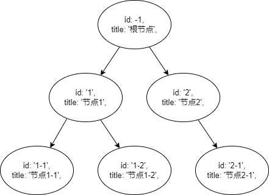

--- 
title: JS树结构操作
date: 2022-04-12 11:11:24
author: 'Mr.Lan'
sidebar: 'auto'
categories: 
 - 前端
tags: 
 - js
 - tree
 - 遍历
 - 递归
publish: true
# autoGroup-2: 
---

JavaScript 中树形结构的**查找**、**遍历**、**筛选**、**树和列表相互转换**
<!-- more -->

先准备一个树结构数据，`children` 属性为本节点的枝丫，没有或者 `children` 长度为 0 则代表自身为叶子节点

``` js
let tree = [{
    id: -1,
    title: '根节点',
    children: [{
            id: '1',
            title: '节点1',
            children: [{
                    id: '1-1',
                    title: '节点1-1'
                },
                {
                    id: '1-2',
                    title: '节点1-2'
                }
            ]
        },
        {
            id: '2',
            title: '节点2',
            children: [{
                id: '2-1',
                title: '节点2-1'
            }]
        }
    ]
}]
```


***
## 1. 广度优先遍历和深度优先遍历

遍历方式：
+ 广度优先遍历是非递归的，通常用循环来实现。
+ 度优先遍历又分为先序遍历、后序遍历，二叉树还有中序遍历，实现方法可以是递归，也可以是循环。


遍历差异：
+ 深度优先，访问完一颗子树再去访问后面的子树，而访问子树的时候，先访问根再访问根的子树，称为先序遍历；先访问子树再访问根，称为后序遍历。
+ 广度优先，即访问树结构的第n+1层前必须先访问完第n层

***
### 2.1 广度优先遍历

广度优先遍历 使用循环的方式来实现，顶层向下的一层一层的访问，代码实现：

``` js
// 广度优先遍历
function treeForeach (tree, func) {
    let node, list = [...tree]
    while (node = list.shift()) {
        func(node)
        node.children && list.push(...node.children)
    }
}
// 测试结果
treeForeach(tree, node => { console.log(node.title) })
// 输出：
// 根节点
// 节点1
// 节点2
// 节点1-1
// 节点1-2
// 节点2-1
```
解读：


1. 申明一个空节点 `node` 
    - 可以给用户处理操作
2. 申明一个列表 `list` 
    - 开始默认为树
    - 只考虑列表，不管每个对象的 `children`
3. 循环开始
4. 把 `list` 的第一个去除赋值给 `node`
5. 用户使用 `node` 进行自定义操作
6. 判断 `node` 是否有 `children`，有就push到 `list` 背后
    - 本意就是将**下层**加入到循环队列中
    - 当第一层循环结束，`list.push(...node.children)` 操作已经将第二层全部加入循环队列，依次循环
7. `list` 没有内容 `while` 判断循环结束

小结：广度优先遍历 利用队列的方式进行逐层循环，循环一层，下一层就进入队列。

***
### 2.3 深度优先遍历递归实现

深度优先递归遍历，平常使用最为频繁的方式

一 、先序遍历，循环节点的同时进行用户操作，并且寻找子节点，当子节点没有 `children` 再进行其他分支（节点）：

``` js
// 先序遍历
function treeForeach (tree, func) {
    tree.forEach(data => { // 循环节点
        func(data) // 用户操作
        data.children && treeForeach(data.children, func) // 遍历子树
    })
}
// 测试结果
treeForeach(tree, node => { console.log(node.title) })
// 输出：
// 根节点
// 节点1
// 节点1-1
// 节点1-2
// 节点2
// 节点2-1
```

图解：


图解看起来可能有点乱，根据文字描述就很好理清：

1. 树传入，进入循环只有一次，**用户操作** `根节点` ，判断 `根节点` **存在子节点**，将子节点丢进方法
2. `根节点` 的子节点有两个，先循环第一个，**用户操作** `节点1` ，判断 `节点1` **存在子节点**，将子节点丢进方法
3. `节点1` 的子节点有两个，先循环第一个，**用户操作** `节点1-1` ，判断 `节点1-1` **不存在子节点**，继续循环
4. `节点1` 的第二个子节点继续循环，**用户操作** `节点1-2` ，判断 `节点1-2` **不存在子节点**，小循环结束
5. 向上查找未结束的循环，`根节点` 的第二个子节点继续循环，**用户操作** `节点2` ，判断 `节点2` **存在子节点**，将子节点丢进方法
6. `节点2` 的子节只有一个，循环只有一次，**用户操作** `节点2-1` ，判断 `节点2-1` **不存在子节点**，小循环结束
7. 向上查找未结束的循环，没有结束全部

将所有的用户操作抽出就和输出结果一致

***
二、后序遍历，跟先序差不多，只不过是先遍历子树找到最深再进行用户操作：

``` js
// 后序遍历
function treeForeach (tree, func) {
    tree.forEach(data => { // 循环节点
        data.children && treeForeach(data.children, func) // 遍历子树
        func(data) // 用户操作
    })
}
// 测试结果
treeForeach(tree, node => { console.log(node.title) })
// 输出：
// 节点1-1
// 节点1-2
// 节点1
// 节点2-1
// 节点2
// 根节点
```

深度优先递归遍历的先序和后序就有点类似 dom 中的 捕获 和 冒泡，先序和捕获就是找的同时进行操作，后序和冒泡就是找到最深向上触发操作

::: danger 警告
递归是对一个函数的反复调用，要注意调用次数过多导致**调用栈溢出**的问题，最好进行[尾递归优化](./wei_di_gui.md)
:::

***
### 2.4 深度优先遍历循环实现

一、先序遍历，与广度优先遍历类似，都在维护一个队列 `list` ，只不过是向前插入：

``` js
function treeForeach (tree, func) {
    let node, list = [...tree]
    while (node = list.shift()) {
        func(node)
        node.children && list.unshift(...node.children)
    }
}
// 测试结果
treeForeach(tree, node => { console.log(node.title) })
// 输出：
// 根节点
// 节点1
// 节点1-1
// 节点1-2
// 节点2
// 节点2-1
```
***

二、后序遍历就略微复杂一点，我们需要不断将子树扩展到根节点前面去，（艰难地）执行列表遍历，遍历到某个节点如果它没有子节点或者它的子节点已经扩展到它前面了，则进行用户操作，否则扩展子节点到当前节点前面：

``` js
function treeForeach (tree, func) {
    let node, list = [...tree], i =  0
    while (node = list[i]) {
        let childCount = node.children ? node.children.length : 0
        if (!childCount || node.children[childCount - 1] === list[i - 1]) {
            func(node)
            i++
        } else {
            list.splice(i, 0, ...node.children)
        }
    }
}
```

***
## 3. 列表和树互相转换

经常会见到需求

### 3.1 列表转树

准备一个 `list` :

``` js
let list = [{
        id: -1,
        title: '根节点'
    },
    {
        id: '1',
        title: '节点1',
        parentId: -1
    },
    {
        id: '1-1',
        title: '节点1-1',
        parentId: '1'
    },
    {
        id: '1-2',
        title: '节点1-2',
        parentId: '1'
    },
    {
        id: '2',
        title: '节点2',
        parentId: '2'
    },
    {
        id: '2-1',
        title: '节点2-1',
        parentId: -1
    }
]
```

列表结构转为树结构，就是把所有非根节点放到对应父节点的chilren数组中，然后把根节点提取出来：

``` js
function listToTree (list) {
    let info = list.reduce((map, node) => (map[node.id] = node, node.children = [], map), {})
    return list.filter(node => {
        info[node.parentId] && info[node.parentId].children.push(node)
        return !node.parentId
    })
}
```
解读：

1. `info` 变成了一个对象，对象属性名就是 `id` 值就是 `id` 对应的对象值，这样形成 id=>node 的映射，免去后期找 `list` 的时间
    ::: tip 映射必要性
    这里首先通过info建立了id=>node的映射，因为对象取值的时间复杂度是O(1)，这样在接下来的找寻父元素就不需要再去遍历一次list了，因为遍历寻找父元素时间复杂度是O(n)，并且是在循环中遍历，则总体时间复杂度会变成O(n^2)，而上述实现的总体复杂度是O(n)。
    :::
2. 我们的返回值要是一个树结构，对比之前的树结构，对于有 `parentId` 的对象绝对不会在第一层 ，因此 `list` 过滤时 有 `node.parentId` 的就要 `false` 所以 `return !node.parentId`
3. 接下来在循环期间将 `info` 复杂化，对于 `list` 的每个有 `parentId` 的节点，将其 `push` 到其对应的对象的 `children` 内


**--由于之前的映射和对象的地址引用原理--**

+ 将 `list` 的 `node` push 到 `info[node.parentId].children` 中，影响的不只是 `info[node.parentId].children`，**还会**导致 `list` 中 parentId与id 对应的对象 `children` 也改变
+ push 操作影响的不只是 `info[node.parentId]` 这一个对象，**还影响**着所有引用了 `info[node.parentId]` 地址的所有位置

>> 操作过程示例：
> 
> 在循环到第三个数组 `{ id: '1-1', title: '节点1-1', parentId: '1' }` 时
> 
> `info['-1']` 的值：
> ``` js
> // id=1的对象已经挂在根节点上
> {
>     id: -1,
>     title: "根节点",
>     children: [
>         {
>             id: '1',
>             title: '节点1',
>             parentId: -1
>         },
>     ],
> }
> ```
> `info['1']` 的值：
> ``` js
> // 等待 id='1-1' 的挂载
> {
>     id: '1',
>     title: '节点1',
>     parentId: -1
> },
> ```
> `list[1]` 的值：
> ``` js
> // 原生对象
> {
>     id: '1',
>     title: '节点1',
>     parentId: -1
> },
> ```
> ***
> 这时候只是做了 `info[node.parentId].children.push(node)` 一步操作，只改动 `info['1']` 的值，但由于映射引用的关系，以上的三个都会受到影响
> 
> `info['-1']` 的值：
> ``` js
> // children[0] 是 list[1] 地址的引用，list[1] 改变也会影响本身
> {
>     id: -1,
>     title: "根节点",
>     children: [
>         {
>             id: '1',
>             title: '节点1',
>             parentId: -1,
>             children: [
>                 {
>                     id: '1',
>                     title: '节点1',
>                     parentId: -1
>                 },
>             ],
>         },
>     ],
> }
> ```
> `info['1']` 的值：
> ``` js
> // info[node.parentId].children.push(node) 操作生效，但是由于映射关系会影响 list[1] 的值
> {
>     id: '1',
>     title: '节点1',
>     parentId: -1,
>     children: [
>         {
>             id: '1',
>             title: '节点1',
>             parentId: -1
>         },
>     ],
> },
> ```
> `list[1]` 的值：
> ``` js
> // 受映射关系而影响
> {
>     id: '1',
>     title: '节点1',
>     parentId: -1,
>     children: [
>         {
>             id: '1',
>             title: '节点1',
>             parentId: -1
>         },
>     ],
> },
> ```

等待所有的找父亲操作结束，`info` 变复杂，`list` 也一样复杂，再经过过滤就剩下根节点打头形成的树结构

***
### 3.2 树转列表

树转列表就是遍历同时提取出列表结构，这种主要是按照**顺序需求**选择合适的遍历方式

``` js
//递归实现
function treeToList (tree, result = [], level = 0) {
    tree.forEach(node => {
        result.push(node)
        node.level = level + 1
        node.children && treeToList(node.children, result, level + 1)
    })
    return result
}

// 循环实现
function treeToList (tree) {
    let node, result = tree.map(node => (node.level = 1, node))
    for (let i = 0; i < result.length; i++) {
        if (!result[i].children) continue
        let list = result[i].children.map(node => (node.level = result[i].level + 1, node))
        result.splice(i+1, 0, ...list)
    }
    return result
}
```

***
## 4. 树筛选

树结构过滤即保留某些符合条件的节点，剪裁掉其它节点。节点是否保留，取决于自身和子节点

``` js
// 深度优先后序遍历过滤节点
function treeFilter (tree, func) {
    // 使用map复制一下节点，避免修改到原树
    return tree.map(node => ({ ...node })).filter(node => {
        node.children = node.children && treeFilter(node.children, func)
        return func(node) || (node.children && node.children.length)
    })
}
```

***
## 5. 树查找

可以有多种需求：
+ 单纯查找节点，返出来
+ 查找某个节点的路径信息
+ 查找树多个节点路径信息

***
### 5.1 查找树节点

查找到就返回节点，没找完返回查找方法继续，没找到返回null

``` js
function treeFind (tree, func) {
    for (const data of tree) {
        if (func(data)) return data
        if (data.children) {
            const res = treeFind(data.children, func)
            if (res) return res
        }
    }
  return null
}
```

***
### 5.2 查找树某节点路径

每次判断操作要储存路径信息，是需要的对象就返回，不对就回溯路径信息

``` js
function treeFindPath (tree, func, path = []) {
    if (!tree) return []
    for (const data of tree) {
        path.push(data.id)// 存下路径信息
        if (func(data)) return path// 匹配正确返回路径信息
        if (data.children) {
            const findChildren = treeFindPath(data.children, func, path)// 深度查找匹配，并且传递先前的路径信息
            if (findChildren.length) return findChildren
        }
        path.pop()// 父节点下本层子节点没有匹配目标，回溯去除路径后一位
    }
    return []
}
```


***
### 5.3 查找树多个节点路径

与查找路径相似

``` js
function treeFindPath (tree, func, path = [], result = []) {
    for (const data of tree) {
        path.push(data.id)
        func(data) && result.push([...path])
        data.children && treeFindPath(data.children, func, path, result)
        path.pop()
    }
    return result
}
```

参考[JS树结构操作:查找、遍历、筛选、树结构和列表结构相互转换](https://www.cnblogs.com/ming1025/p/13677512.html)