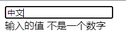
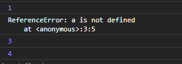

## **1. js中的 try/catch/finally**

JavaScript中的 `try/catch/finally` 语句用于处理代码中可能出现的错误信息。

错误可能是语法错误，通常是程序员造成的编码错误或错别字。也 可能是拼写错误或语言中缺少的功能（可能由于浏览器差异）。

+ try 语句允许我们定义在执行时进行错误测试的代码块。
+ catch 语句允许我们定义当 try 代码块发生错误时，所执行的代码块。
+ finally 语句在 try 和 catch 之后无论有无异常都会执行。

::: danger try使用注意
1. catch 和 finally 语句都是可选的，但你在使用 try 语句时必须至少使用一个。
2. 当错误发生时， JavaScript 会**停止执行**，并生成一个错误信息。使用 `throw` 语句 来创建自定义消息(抛出异常)。如果你将 `throw` 和 `try` 、 `catch`一起使用，就可以控制程序输出的错误信息。
:::

## **2. 使用 try/catch/finally**

``` js
try {
    tryCode - 尝试执行代码块
}
catch(err) {
    catchCode - 捕获错误的代码块
}
finally {
    finallyCode - 无论 try / catch 结果如何都会执行的代码块
}
```

| 参数 | 描述 |
| --- | --- |
| tryCode | 必须。检查是否有错误的代码块。 |
| err |必须(如果使用 catch)。指定局部变量应用的错误。该变量可以引用 Error 对象 (包含发生的错误信息，如 "'addlert' 没有定义")。如果异常通过 throw 语句创建 ， 该 变量引用了为在throw语句中指定的对象 (查看 "更多实例") |
| catchCode	| 可选。如果 try 语句发生错误执行的代码块。如果 try 语句没发生错误该代码不会执行。 |
| finallyCode | 可选。无论 try / catch 的结果如何都会执行。 |

## **3. 使用 try/catch/finally**

``` html
<script>
    function myFunction() {
        var message, x;
        message = document.getElementById("message");
        message.innerHTML = "234";
        x = document.getElementById("demo").value;
        try { 
            if(x == "")  throw "为空";
            if(isNaN(x)) throw "不是一个数字";
            if(x > 10)   throw "太大";
            if(x < 5)    throw "太小";
        }
        catch(err) {
            message.innerHTML = "输入的值 " + err;
        }
        finally {
            document.getElementById("demo").value = "";
        }
    }
</script>
<body>
    <input id="demo" value="测试" onBlur="myFunction()"></input>
    <div id="message"></div>
</body>
```

以上代码执行：
1. 获取 `id=message` 的dom，清空内容
2. 在 `try` 内判断输入框的值类型，并且抛出异常
3. `catch` 捕获异常修改 dom 的内容
4. 执行必须片段 `finally` 清空input

这样就形成了一个输入类型判断器的功能



## **4. 关于try异常停止JavaScript执行问题（重点注意）**

正常情况下，执行一段有问题的代码会终止后续的执行，例如：

``` js
console.log(1);
a(); // 不存在 a() 方法
console.log(2);
```


控制台阻止了 `console.log(2)` 的输出

但是在 `try` 内执行错误代码,只会影响 `try` 内的内容,JavaScript的停止只会在这一段内生效,并不会影响后续代码,可以理解为 `try` 是测试空间,代码只是执行测试获取异常结果

``` js
try { 
    console.log(1);
    a(); // 不存在 a() 方法
    console.log(2);
}
catch(err) {
    console.log(err);
}
finally {
    console.log(3);
}
console.log(4);
```

除了 2 不会输出其他都照常，因此并没有影响主进程


