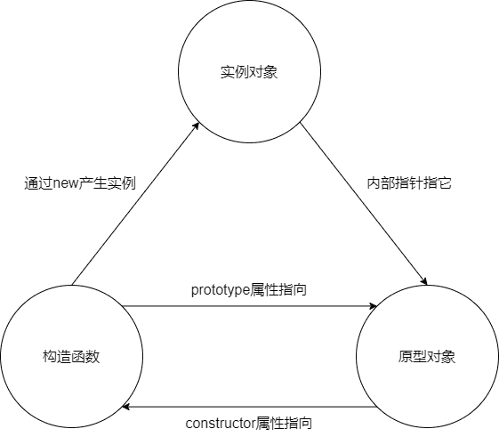

--- 
title: 对加载大数据滚动视窗导致页面卡顿的白屏优化
date: 2024-06-06 17:29:46
author: 'Mr.Lan'
sidebar: 'auto'
categories: 
 - 前端
tags: 
 - js
 - 优化
publish: true
# autoGroup-2: 
# autoPrev: 
---

通常滚动窗的口内容，即使不在可视内，过多也会导致整个页面的卡顿，这个卡顿不仅仅只在浏览上，甚至还会导致逻辑层面的卡顿。针对大量数据的渲染卡顿，以普通的`overflow：auto`容器来进行白屏优化。

## 问题

通常情况下在一个滚动视窗内，我们并不会加载大量的内容，通常都是分页加载或是触底增加。

但是随着用户浏览的过多，触底增加也会原来越多。

为了保证用户的浏览体验，也并不会把之前浏览的内容进行删除掉（通常情况）

这时候就可以使用特殊的方式对不在显示区域内的元素进行优化掉，以减轻浏览器的压力

vue中也有类似的插件可以直接实现这个效果，但是我们目前来直接实现

## 思路

像`element-plus`中虚拟化表格也是实现白屏优化的一种方式，不过我并没有参考它的思路



### 第一步

首先我将一个div的内容分为了三段

**前置占位空盒**

**具体内容**

**后置占位空盒**

其中具体内容又分为**前缓冲内容**、**真正显示内容**、**后缓冲内容**

### 第二步

具体想法：

监听用户的滚动，计算当前应该显示的第几条至第几条的内容

将**前置占位盒的高度**修改为**具体内容前面的条目总高度和**，**后置占位盒高度**也同理

然后实时更新中间的现实内容

## 实现

根据以上思路先写好模板内容，顺便优化下布局

主要内容仅仅在以下代码标记的几行中

``` html{18-39}
<template>
	<div style="width: 100vw; height: 100vh; padding: 200px">
		<div
			style="width: 800px; height: 500px; padding: 10px; background: #eee"
		>
			<div style="width: 100%; height: 100%; overflow: hidden">
				<!-- 主视图就在其中 -->
				<div
					style="
						width: 100%;
						height: 100%;
						background: #fff;
						overflow-y: scroll;
						overflow-x: hidden;
					"
					@scroll="scroll"
				>
					<div :style="'height: ' + height1 + 'px;'">
						这是前置占位空盒
					</div>
					<div
						v-for="i in currentNum"
						:key="i.id"
						style="height: 50px"
					>
						每条高度50px，这是第列表的{{ i.id }}下标位置,{{
							i.value
						}}
						<div
							:style="
								'width: ' +
								(i.id % 100) +
								'%;height:10px;background: lightslategray'
							"
						></div>
					</div>
					<div :style="'height: ' + height2 + 'px;'">
						这是后置占位空盒
					</div>
				</div>
			</div>
		</div>
	</div>
</template>
```

---

确定好内容就开始编写逻辑部分

先创建一个**一百万**长度的对象数组作为显示内容

``` js
const largeArray = [];
for (let i = 0; i < 1000000; i++) {
	largeArray.push({
		id: i,
		value: `Item ${i + 1}`,
	});
}
```

如果把这个对象直接进行简单的循环渲染显示，浏览器明显能感受到卡顿，光这个页面内存的占用也达到**五个G**左右，显然是不合理的

---

按照想法来确定三要素的初始值

+ `current`：当前视窗内显示的第一个为总条目中的第几条
+ `arr`：整个真正渲染的少部条目
+ `height1`：前置占位盒的高度
+ `height2`：后置占位盒的高度

``` js
let current = 1;
const arr = largeArray.slice(current - 1, 15);
const currentNum = ref(arr);

const height1 = ref((current - 1) * 50);
const height2 = ref((largeArray.length - 15) * 50);
```

---

最后监听用户在这个盒子上的滚动事件，来进行计算更新

对于最前面和最后面要注意不要导致三个元素加起来的总高度超过总条目应该拥有的高度

计划是显示框有10条目，上下各有5个缓冲条目，用于防止拖拽过快的计算空白

``` js
function scroll(e) {
    // 获取容器
	let div = e.target;
    // 计算当前可视范围内应该显示的第一条是第几条
	let num = Math.ceil(div.scrollTop / 50);
    // 防止负数
	if (num == 0) num = 1;
    // 和记录进行匹配是否进入三要素的更新计划
	if (current !== num) {
        // 更新记录当前第一条的条目号
		current = num;
        // 计算前置占位盒需要替换几个条目，并且预留五个缓冲
		let top = num - 1 - 4 < 0 ? 0 : num - 1 - 4;
        // 同理计算后置占位
		let bottom =
			num - 1 + 16 > largeArray.length ? largeArray.length : num - 1 + 16;
        // 计算出相对应的两个占位盒高度
		height1.value = top * 50;
		height2.value = (largeArray.length - bottom) * 50;
        // 替换新的实际显示对象
		currentNum.value = largeArray.slice(top, bottom);
	}
}
```

---

由此就设计完，可以试一下显示效果。

完整代码如下


``` vue
<template>
	<div style="width: 100vw; height: 100vh; padding: 200px">
		<div
			style="width: 800px; height: 500px; padding: 10px; background: #eee"
		>
			<div style="width: 100%; height: 100%; overflow: hidden">
				<!-- 主视图就在其中 -->
				<div
					style="
						width: 100%;
						height: 100%;
						background: #fff;
						overflow-y: scroll;
						overflow-x: hidden;
					"
					@scroll="scroll"
				>
					<div :style="'height: ' + height1 + 'px;'">
						这是前置占位空盒
					</div>
					<div
						v-for="i in currentNum"
						:key="i.id"
						style="height: 50px"
					>
						每条高度50px，这是第列表的{{ i.id }}下标位置,{{
							i.value
						}}
						<div
							:style="
								'width: ' +
								(i.id % 100) +
								'%;height:10px;background: lightslategray'
							"
						></div>
					</div>
					<div :style="'height: ' + height2 + 'px;'">
						这是后置占位空盒
					</div>
				</div>
			</div>
		</div>
	</div>
</template>

<script setup>
import { ref } from "vue";
const largeArray = [];
for (let i = 0; i < 1000000; i++) {
	largeArray.push({
		id: i,
		value: `Item ${i + 1}`,
	});
}
// console.log(largeArray);

let current = 1;
const arr = largeArray.slice(current - 1, 15);
const currentNum = ref(arr);

const height1 = ref((current - 1) * 50);
const height2 = ref((largeArray.length - 15) * 50);
function scroll(e) {
	let div = e.target;
	let num = Math.ceil(div.scrollTop / 50);
	if (num == 0) num = 1;
	if (current !== num) {
		current = num;
		let top = num - 1 - 4 < 0 ? 0 : num - 1 - 4;
		let bottom =
			num - 1 + 16 > largeArray.length ? largeArray.length : num - 1 + 16;
		// console.log(
		// 	"当前第",
		// 	current,
		// 	`应当显示下标${top}到${bottom}`,
		// 	"上占位高度",
		// 	top * 50,
		// 	"下占位高度",
		// 	(largeArray.length - bottom) * 50
		// );
		height1.value = top * 50;
		height2.value = (largeArray.length - bottom) * 50;
		currentNum.value = largeArray.slice(top, bottom);
	}
}
</script>
```


``` js
function throttle(func, wait) {
    let _this, args;
    // 之前的时间戳
    let old = 0;
    return function(...args) {
        // 保存this
        _this = this;
        // 获取当前时间戳
        let now = new Date().valueOf();
        if (now - old > wait) {
            // 立即执行
            func.apply(_this, args);
            lod = now;
        }
    }
}
```

## 定时器实现节流函数（后触发前不触发）

第一次不会被触发，最后一次会触发，代码如下：

``` js
function throttle(func, wait) {
    let _this, args, timeout;
    return function(...args) {
        _this = this;
        if (!timeout) {
            timeout = setTimeout(() => {
                timeout = null;
                func.apply(_this, args);
            }, wait)
        }
    }
}
```

## 标准节流函数

上面两种是为了更好的了解实现方式，标准的节流函数能够配置最开始和末尾是否需要执行包装函数

``` js
throttle(func, 1000, {
    leading: false,   //是否立即执行
    trailing: true     //最后一次是否执行
    //两者不能同为false,否则就会产生bug,会导致触发事件立即执行一次后就失效了!
})
```

具体代码如下：

``` js
function throttle(func, wait, options) {
    let _this, args, timeout;
    let old = 0; //时间戳
    //如果没有options就将其设置为空对象
    if (!options) options = {};
    let later = function() {
        // 记录定时器触发的执行，作为旧时间和新的频繁触发对比
        old = new Date().valueOf();
        timeout = null;
        func.apply(_this, args);
    }
    return function(...args) {
        // 保存this
        _this = this;
        // 记录频繁触发的每次时间
        let now = new Date().valueOf();
        // 第一次进来判断是否要第一次执行
        if (options.leading === false && !old) {
            old = now;// 不需要第一次执行
        }
        // 第一次直接执行，不需要的话 now - old = 0 > wait
        if (now - old > wait) {
            if (timeout) {
                clearTimeout(timeout);
                timeout = null;
            }
            func.apply(_this, args);
            old = now;
        } else if (!timeout && options.trailing !== false) {
            // 定时器清除表示超时操作结束，后续补上最后一次执行
            timeout = setTimeout(later, wait)
        }
    }
}
```