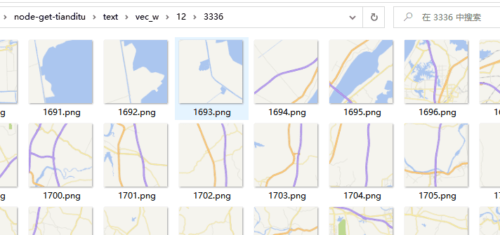

--- 
title: 通过 nodejs 爬取天地图瓦片数据，实现内网访问
date: 2022-06-01 16:03:23
author: 'Mr.Lan'
sidebar: 'auto'
categories: 
 - 前端
tags: 
 - nodejs
 - js
 - gis
publish: true
# autoGroup-1: 
# autoPrev: 
---

有时候需要在内网中访问天地图瓦片数据，利用原生天地图JavaScript API修改源码实现功能
<!-- more -->

代码地址[GitHub](https://github.com/MrLanYX/node-get-tianditu)

实现步骤及原理

1. 通过随机生成不同的设备名、IP、服务器号码去请求天地图的瓦片数据
2. 再通过`Bagpipe`生成并发队列去下载素材按照格式保存至本地
3. 修改 `JavaScript API 4.0` 源码将请求引导至自定义资源目录 配合后台取得瓦片

详细使用在仓库中有介绍