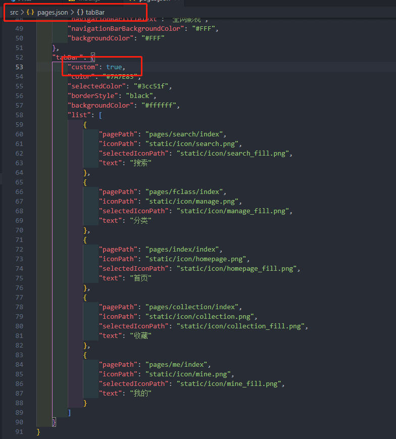
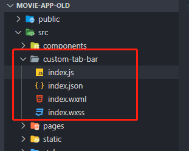

--- 
title: uni-app 使用自定义 tabBar 导航栏
date: 2022-05-09 15:08:47
author: 'Mr.Lan'
sidebar: false
categories: 
 - 前端
tags: 
 - vue
 - uni-app
publish: true
---

官方默认底部导航栏样式自由度不够，解决需要自定义样式

## 自定义 uni-app 小程序 tabBar 导航栏方案

1. 使用小组件在每个页面加载

这种方式编写起来方便，但是每个页面都会生成导航栏组件，对于原生让费性能

**不建议使用**

***

2. 推荐方法：创建导航栏文件替换默认

在配置文件中把自定义功能打开，并且配置好导航栏内容



在根目录创建微信四件套



`index.js` 按照先前的进行配置：

页面生命周期中的设置索引方法

``` js
Component({
  data: {
    selected: 2,
    color: "#7A7E83",
    selectedColor: "#ff9234",
    list: [{
      pagePath: "/pages/search/index",
      iconPath: "/static/icon/search.png",
      selectedIconPath: "/static/icon/search_fill.png",
      text: "搜索"
    },
    {
      pagePath: "/pages/fclass/index",
      iconPath: "/static/icon/manage.png",
      selectedIconPath: "/static/icon/manage_fill.png",
      text: "分类"
    },
    {
      pagePath: "/pages/index/index",
      iconPath: "/static/icon/homepage.png",
      selectedIconPath: "/static/icon/homepage_fill.png",
      text: "首页"
    },
    {
      pagePath: "/pages/collection/index",
      iconPath: "/static/icon/collection.png",
      selectedIconPath: "/static/icon/collection_fill.png",
      text: "收藏"
    },
    {
      pagePath: "/pages/me/index",
      iconPath: "/static/icon/mine.png",
      selectedIconPath: "/static/icon/mine_fill.png",
      text: "我的"
    }]
  },
  attached() {
  },
  methods: {
    switchTab(e) {
      const data = e.currentTarget.dataset
      const url = data.path
      wx.switchTab({ url })
      this.setData({
        selected: data.index
      })
    }
  }
})
```

`index.json` 配置;

``` json
{
  "component": true
}
```

`index.wxml` 示例内容，这块按照自己需求写：

``` html
<!--miniprogram/custom-tab-bar/index.wxml-->
<cover-view class="tab-bar">


  <cover-view class="tab-bar-o"></cover-view>


  <cover-view class="tab-bar-o a">

    <cover-view class="tab-bar-item" data-path="{{list[2].pagePath}}" data-index="2" bindtap="switchTab">
      <cover-image src="{{selected == 2 ? list[2].selectedIconPath : list[2].iconPath}}"></cover-image>
      <cover-view style="color: {{selected == 2 ? selectedColor : color}}">{{list[2].text}}</cover-view>
    </cover-view>

  </cover-view>


  <cover-view class="tab-bar-main">

    <cover-view class="tab-bar-item" data-path="{{list[0].pagePath}}" data-index="0" bindtap="switchTab">
      <cover-image src="{{selected == 0 ? list[0].selectedIconPath : list[0].iconPath}}"></cover-image>
      <cover-view style="color: {{selected == 0 ? selectedColor : color}}">{{list[0].text}}</cover-view>
    </cover-view>

    <cover-view class="tab-bar-item l" data-path="{{list[1].pagePath}}" data-index="1" bindtap="switchTab">
      <cover-image src="{{selected == 1 ? list[1].selectedIconPath : list[1].iconPath}}"></cover-image>
      <cover-view style="color: {{selected == 1 ? selectedColor : color}}">{{list[1].text}}</cover-view>
    </cover-view>

    <cover-view class="zhongjian"></cover-view>

    <cover-view class="tab-bar-item r" data-path="{{list[3].pagePath}}" data-index="3" bindtap="switchTab">
      <cover-image src="{{selected == 3 ? list[3].selectedIconPath : list[3].iconPath}}"></cover-image>
      <cover-view style="color: {{selected == 3 ? selectedColor : color}}">{{list[3].text}}</cover-view>
    </cover-view>

    <cover-view class="tab-bar-item" data-path="{{list[4].pagePath}}" data-index="4" bindtap="switchTab">
      <cover-image src="{{selected == 4 ? list[4].selectedIconPath : list[4].iconPath}}"></cover-image>
      <cover-view style="color: {{selected == 4 ? selectedColor : color}}">{{list[4].text}}</cover-view>
    </cover-view>

  </cover-view>


</cover-view>
```

`index.wxss` 示例内容，这块按照自己需求写：

``` css
.tab-bar {
  position: relative;
  width: 750rpx;
  height: 140rpx;
  position: fixed;
  bottom: 0;
  left: 0;
  right: 0;
}

.tab-bar-o {
  width: 110rpx;
  height: 110rpx;
  background-color: #fff;
  border: 1px solid chocolate;
  border-radius: 50%;
  position: absolute;
  top: 10rpx;
  left: 0;
  right: 0;
  margin: auto;
  z-index: 1;
  box-shadow: 0 0 10px rgba(255, 152, 114, 0.8);
}

.tab-bar-main {
  position: absolute;
  bottom: 0;
  left: 0;
  right: 0;
  height: 80rpx;
  background-color: #fff;
  border-top: 1px solid chocolate;
  box-shadow: 0 0 10px rgba(255, 152, 114, 0.8);
  z-index: 2;
  display: flex;
}

cover-view.a {
  background-color: #ff9234;
  border-top: 1px solid chocolate;
  z-index: 3;
  display: flex;
  justify-content: center;
  align-items: center;
  flex-direction: column;
}
.a cover-view{
  color: #fff !important;
}

.tab-bar-item {
  flex: 1;
  display: flex;
  justify-content: center;
  align-items: center;
  flex-direction: column;
}
.zhongjian{
  width: 150rpx;
  height: 100%;
}

.tab-bar-item cover-image {
  width: 27px;
  height: 27px;
}

.tab-bar-item cover-view {
  font-size: 10px;
  text-align: center;
}
```

重点来了，我们现在需要在导航页进入后给导航栏传递当前，应该把哪个按钮高亮起来最为当前页的提示

在 `uni-app` 的 `vue` 页面生命周期 `onShow` 中：

``` js
onShow() {
    if (
        typeof this.$mp.page.getTabBar === "function" &&
        this.$mp.page.getTabBar()
    ) {
        this.$mp.page.getTabBar().setData({
            selected: 0, // 当前页面的对应的数组序号
        });
    }
}
```

这里要注意 `this` 是指向 `uni-app` 实例，微信的实例在更深的 `$mp` 中

[参考文章](https://developers.weixin.qq.com/community/develop/article/doc/0000047ece8448712589b28525b413)