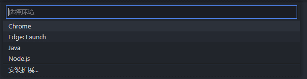
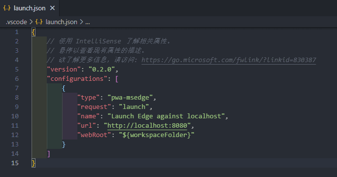
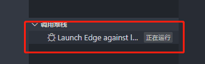

--- 
title: 在 VS code 中调试 Vue.js
date: 2022-03-30 10:29:25
author: 'Mr.Lan'
sidebar: 'auto'
categories: 
 - 前端
tags: 
 - vue
 - debug
publish: true
# autoGroup-3: 
---

## **1. VS code调试Vue.js的必要性**

平常情况下我们都是直接在浏览器中直接进入 `F12` 进行断点调试

或者借助 Vue 的调试工具 VS code 进行查看数据变化、事件触发、Vuex等

---

**第一种调试方式：**
+ 必须在代码中写入 `debug` 生效
+ 或是 `log()` 再通过控制台进入代码位置手动打上断点，刷新后生效

这种触发调试的方式较为麻烦

**第二种调试方式：**
+ 适合查看组件的数据状态
+ 适合查看 Vuex 状态
+ 适合观察`emit`事件触发情况

devtools 适合观察整体的状态，并不适合查看单个方法的细节

---

因此在VS code直接断点观察就成为了较为方便的方式

当然 devtools 工具的整体观察能力还是更为出色，按需使用调试方式

## **2. VS code调试Vue.js的方法**

官方调试使用方式已经很详细，在此只是快速上手，详情和问题移至[官网](https://cn.vuejs.org/v2/cookbook/debugging-in-vscode.html)

### 2.1 调试先决条件

想使用 VS code 调试首先满足几点：
1. 安装了能够支持的浏览器 `Chrome` 、`Edge` 、`Firefox`
2. 项目是使用 [`Vue CLI`](https://github.com/vuejs/vue-cli) 搭起

### 2.2 VS code配置调试

在VS code中找到调试工具

创建您所需要的浏览器配置文件，这里我选择的是Edge

之后会在根目录自动生成 `.vscode/launch.json` 文件，只需要把端口和项目预设的端口修改为一致即刻

### 2.3 VS code启动调试

以上配置完完成保存后

正常启动项目，再点击调试工具顶部的绿色按钮

弹出浏览器后，调用堆栈出现正在运行即表示进入调试成功，可以进行断点测试了

