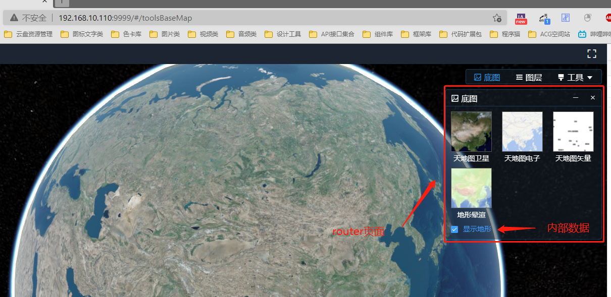

--- 
title: vue路由如何不销毁组件，保留数据
date: 2021-05-25 16:49:52
author: 'Mr.Lan'
sidebar: 'auto'
categories: 
 - 前端
tags: 
 - vue
 - router
publish: true
# autoGroup-1: 
---

## **1. 描述**
vue的router切换时，默认情况下会伴随着组件销毁

但是在有些特定情况下不需要销毁组件
***

***

## **2. 解决**
可以采用keepAlive的缓存功能

``` js
<keep-alive>
    <router-view v-if="$route.meta.keepAlive"></router-view>
</keep-alive>
<router-view v-if="!$route.meta.keepAlive"></router-view>
```

在路由的参数中增加开启
``` js
{
    path:'/system', 
    component:system,
    name:'system',
    meta:{ keepAlive: true}
},
```