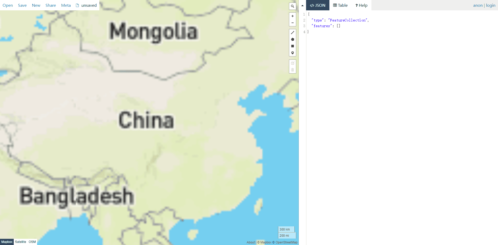

--- 
title: ECharts所需的全国省市区地区json格式geo数据
date: 2022-03-31 11:24:37
author: 'Mr.Lan'
sidebar: 'auto'
categories: 
 - 前端
tags: 
 - ECharts
 - geo
 - gis
publish: true
---

## 全球各个地区的geojson数据

[获取地址](http://datav.aliyun.com/portal/school/atlas/area_selector)

## 支持在线绘制保存的GIS服务网址

[获取地址](http://geojson.io)

