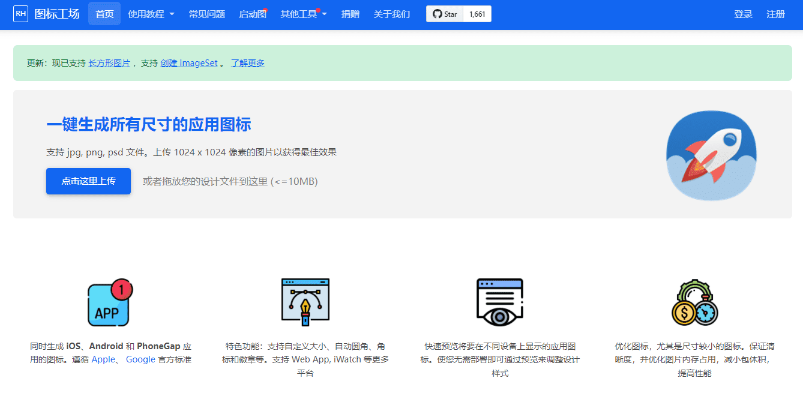

## 1. 图标工厂 - 图标处理

用来快速生成**多尺寸**图标  ——[地址](https://icon.wuruihong.com/)

## 2. 搞定设计 - 在线设计

**在线的设计**工具  ——[地址](https://www.gaoding.com/)

+ 还有各种网页模板版、ppt模板等
+ 个人最为实用的是[在线PS](https://ps.gaoding.com/#/)

## 3. iLoveIMG - 图片处理

图片处理工具  ——[地址](https://www.iloveimg.com/zh-cn)

+ 图片大小**压缩**，稍微降低一点质量不改变尺寸的情况下压缩图片的大小
+ 调整图片尺寸大小
+ 裁切图片
+ JPG与其他格式**转换**
+ 多个JPG**制作GIf动画**
+ 加水印
+ 等等图片处理

## 4. diagrams - 在线画布

在线的画布工具，支持图片导入生成矢量画布编辑修改  ——[地址](https://app.diagrams.net/?lang=zh)

