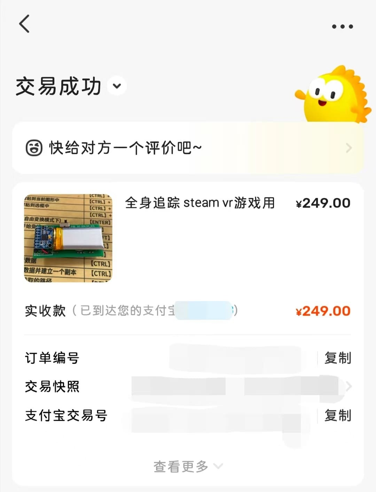

--- 
title: 基于esp8266、MPU-6050六轴感应模块制作的 SlimeVR 全身追踪模块
date: 2024-05-11 10:24:20
author: 'Mr.Lan'
sidebar: 'auto'
categories: 
 - 硬件
tags: 
 - 开发板
 - esp8266
 - MPU-6050
 - SlimeVR
publish: true
# autoGroup-1: 
# autoPrev: 
---

如图╮(╯▽╰)╭

