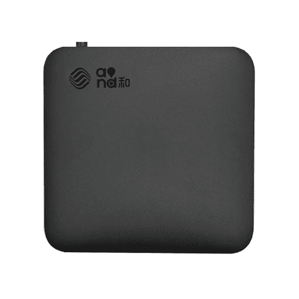

--- 
title: 移动电视盒cm211-1破解刷机
date: 2022-04-19 15:04:31
author: 'Mr.Lan'
sidebar: 'auto'
categories: 
 - 硬件
tags: 
 - 盒子
 - cm211-1
 - 转载
publish: true
# autoGroup-1: 
# autoPrev: 
---

移动宽带送了电视盒型号是cm211-1

移动电视盒的特点是只能在移动的宽带下，并且开通了相关的服务才可以用。电视盒开机就要输入用户名和密码，而且这个电视盒还是和账号绑定的。就是如果你不用，别人也不能用（这个可以通过10086电话进行解除设备绑定）。你的服务到期了不续费也不能用。

这个盒子的硬件配置还是可以的。晶晨905芯片 2g内存 8g的rom，怎么样感觉是不是有点想那个 N1.但是别想多 。这个盒子现在只有安卓4.2的系统。我不不知道为啥运营商的盒子都是这样低的系统，因为便宜够用吧。

破解方法如下。

1. 拆机。背面又4个脚，其中2个是胶皮的脚垫。拨下脚垫就可以打开，不需要很暴力，下面就是螺丝。这个机器就2个螺丝。
2. 准备好固件。[http://www.marker-soft.com/soft/18424.htm](http://www.marker-soft.com/soft/18424.htm)（已失效）
3. 准备刷机软件：USB_Burning_Tool，注意这个软件网上流行的版本在win7下可以完美使用，但是在win10下会找不到设备，所以有条件用我这个版本，或者去找最新的版本。

1. 屏蔽芯片引脚，正好是第5和第6个芯片。我是用iphone的视频拍摄当放大镜，然后用一个订书钉放在这两个脚中间，然后用胶布黏上搞定短接

1. 准备两头都是usb的刷机线。就是两头都是一样，都是和U盘接口一样的头。
2. 打开刷机软件--载入下载的镜像--开始（没错啥都没上就开始，开始后再接设备）
3. cm211-1 接上电源，然后usb刷机线接到离网卡最近的那个usb口上。刷机线另外一端接到电脑usb上。
4. 如果看见刷机软件里面有显示设备了。恭喜赶快拿走短接的订书钉，然后等待100%完成就可以了。记得是看见识别出设备就拿走。一直放在那里会报错进行不下去。即便报错了，拿走后还可以继续刷，不需要重新来过。如果找不到那就说明短接没做好。继续做，耐心点！

***

本人按照教程刷机后的效果，需要固件可以联系提供备份