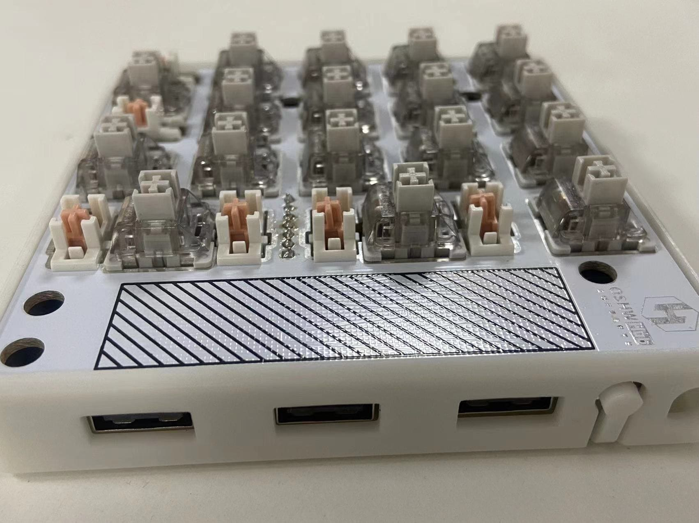
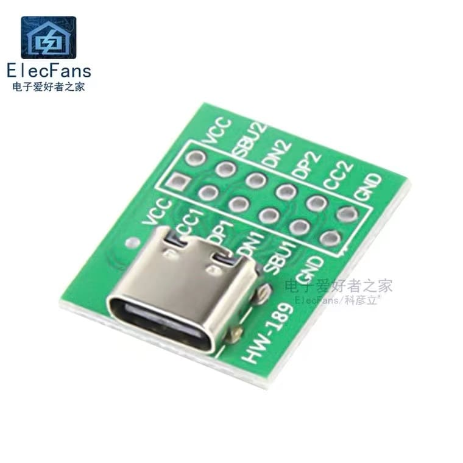

--- 
title: 复刻数字功能区小键盘
date: 2022-12-19 11:45:35
author: 'Mr.Lan'
sidebar: 'auto'
categories: 
 - 硬件
tags: 
 - 开发板
 - 键盘
 - 扩展坞
publish: true
# autoGroup-1: 
# autoPrev: 
--- 

根据立创HUB上-画板当吃生菜-作者的开源项目[【源码已开】最丐17+4+触摸机械键盘PRO](https://oshwhub.com/yangzen/xing-huo-ji-hua-zui-gai-17-4-chu-mo-ji-xie-jian-pan-pro)复刻的数字区键盘
<!-- more -->

详细的项目设计与内用直接上源地址参考学习，这里只简述下一些制作时的经历

这个项目产品本身就带有好几种功能

1. 标准的数字区键盘功能
2. 常用按键的快捷键
3. rgb自定义灯光
4. 触摸滑动调节
5. 三个USB扩展坞

键盘本身的功能还是非常强大的，奈何自身焊工技术不行，12脚的C口五块板子就成功了两块，卖掉了一套回本

后续考虑以后的复刻项目采用插脚的C口原件替换

