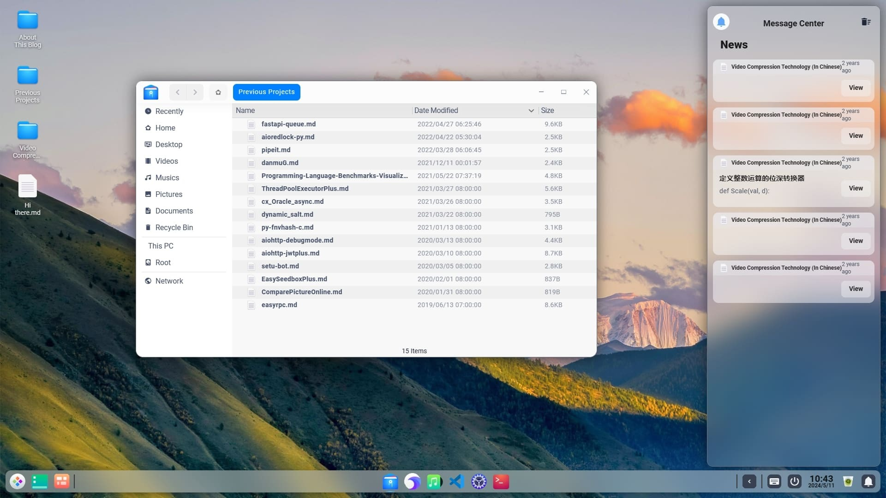

--- 
title: 基于 egg + vue3 编写的全栈NAS系统（仿macOS风格）
date: 2024-05-11 10:16:35
author: 'Mr.Lan'
sidebar: 'auto'
categories: 
 - 软件
tags: 
 - nas系统
 - vue3
 - egg
publish: true
# autoGroup-1: 
# autoPrev: 
---

先放一张大致效果图

---

### 项目起因

该项目之初本是我自身用vue2写的前端，朋友写用java写的后端，但是后期各自都忙碌起来没有时间，各自在不同的城市交流也不方便就一直停滞了。

前端：[https://github.com/MrLanYX/violet-microservice-UI](https://github.com/MrLanYX/violet-microservice-UI)

后端：[https://github.com/MrLanYX/violet-microservice](https://github.com/MrLanYX/violet-microservice)

---

如今vue2也在年初停止维护，所以趁此机会纯靠个人重启这个nas项目，由于工作原因最为熟悉了解的语言是**JavaScript**。所以前端定位vue3，后端采用nodejs编写、阿里开源的框架————eggjs

### 项目进度

2024-05-11 博客开始写的时间，项目基本的框架已经搭起，现在就是学习egg的理念、理清业务继续编写剩余内容

项目地址：[https://github.com/MrLanYX/nas](https://github.com/MrLanYX/nas)